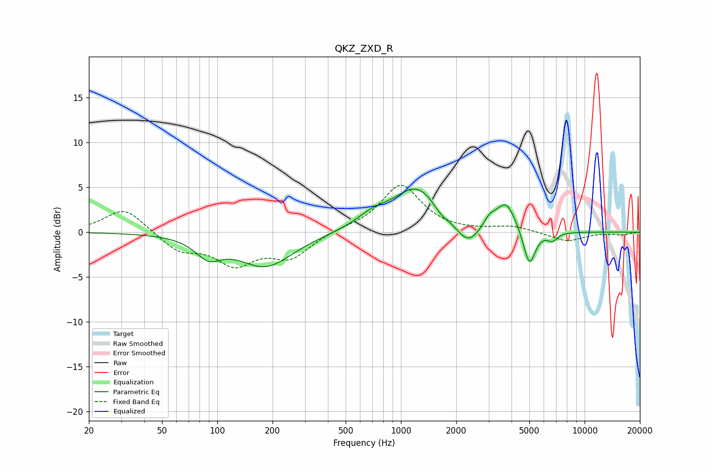

# QKZ_ZXD_R
See [usage instructions](https://github.com/jaakkopasanen/AutoEq#usage) for more options and info.

### Parametric EQs
Apply preamp of -4.9 dB when using parametric equalizer.

|   # | Type    |   Fc (Hz) |    Q |   Gain (dB) |
|-----|---------|-----------|------|-------------|
|   1 | Peaking |        89 | 2.03 |        -2.1 |
|   2 | Peaking |       183 | 0.95 |        -3.8 |
|   3 | Peaking |       701 | 1.55 |         1.3 |
|   4 | Peaking |      1230 | 1.09 |         5   |
|   5 | Peaking |      1646 | 3.26 |        -0.8 |
|   6 | Peaking |      2311 | 2.1  |        -2.6 |
|   7 | Peaking |      3036 | 4.05 |         1.1 |
|   8 | Peaking |      3740 | 2.61 |         3.2 |
|   9 | Peaking |      5002 | 4.25 |        -4.2 |
|  10 | Peaking |      6677 | 4.94 |        -0.9 |

### Fixed Band EQs
When using fixed band (also called graphic) equalizer, apply preamp of **-5.3 dB** (if available) and set gains manually with these parameters.

|   # | Type    |   Fc (Hz) |    Q |   Gain (dB) |
|-----|---------|-----------|------|-------------|
|   1 | Peaking |        31 | 1.41 |         2.8 |
|   2 | Peaking |        62 | 1.41 |        -2   |
|   3 | Peaking |       125 | 1.41 |        -3.3 |
|   4 | Peaking |       250 | 1.41 |        -2.7 |
|   5 | Peaking |       500 | 1.41 |         0.3 |
|   6 | Peaking |      1000 | 1.41 |         5.3 |
|   7 | Peaking |      2000 | 1.41 |         0   |
|   8 | Peaking |      4000 | 1.41 |         0.6 |
|   9 | Peaking |      8000 | 1.41 |        -1   |
|  10 | Peaking |     16000 | 1.41 |        -0.3 |

### Graphs

