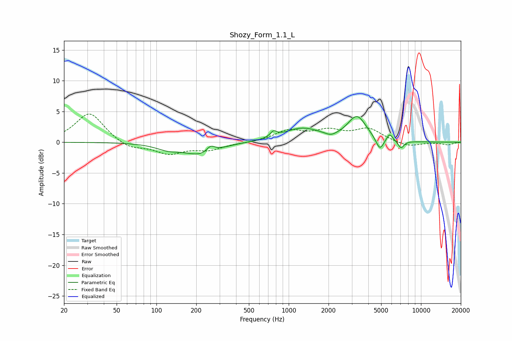

# Shozy_Form_1.1_L
See [usage instructions](https://github.com/jaakkopasanen/AutoEq#usage) for more options and info.

### Parametric EQs
Apply preamp of -4.3 dB when using parametric equalizer.

|   # | Type    |   Fc (Hz) |    Q |   Gain (dB) |
|-----|---------|-----------|------|-------------|
|   1 | Peaking |       123 | 1.54 |        -0.9 |
|   2 | Peaking |       220 | 1.14 |        -2   |
|   3 | Peaking |       257 | 4.39 |         1.1 |
|   4 | Peaking |       768 | 6    |         0.9 |
|   5 | Peaking |      1259 | 1.01 |         2.2 |
|   6 | Peaking |      2087 | 3.44 |        -0.5 |
|   7 | Peaking |      3284 | 2.02 |         4   |
|   8 | Peaking |      4883 | 4.7  |        -2.1 |
|   9 | Peaking |      5796 | 6    |         1.2 |
|  10 | Peaking |      7066 | 5.99 |        -1.2 |

### Fixed Band EQs
When using fixed band (also called graphic) equalizer, apply preamp of **-4.7 dB** (if available) and set gains manually with these parameters.

|   # | Type    |   Fc (Hz) |    Q |   Gain (dB) |
|-----|---------|-----------|------|-------------|
|   1 | Peaking |        31 | 1.41 |         4.9 |
|   2 | Peaking |        62 | 1.41 |        -1.2 |
|   3 | Peaking |       125 | 1.41 |        -1.8 |
|   4 | Peaking |       250 | 1.41 |        -1.1 |
|   5 | Peaking |       500 | 1.41 |        -0.1 |
|   6 | Peaking |      1000 | 1.41 |         1.8 |
|   7 | Peaking |      2000 | 1.41 |         1.6 |
|   8 | Peaking |      4000 | 1.41 |         2.1 |
|   9 | Peaking |      8000 | 1.41 |        -0.8 |
|  10 | Peaking |     16000 | 1.41 |        -0.4 |

### Graphs

