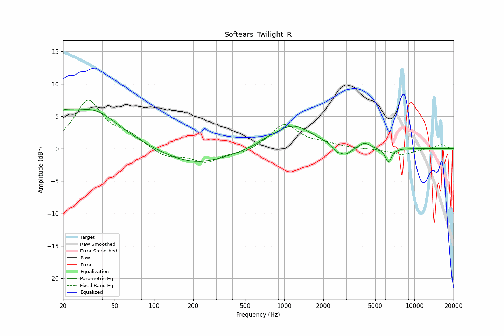

# Softears_Twilight_R
See [usage instructions](https://github.com/jaakkopasanen/AutoEq#usage) for more options and info.

### Parametric EQs
Apply preamp of -6.2 dB when using parametric equalizer.

|   # | Type    |   Fc (Hz) |    Q |   Gain (dB) |
|-----|---------|-----------|------|-------------|
|   1 | Peaking |        20 | 5.34 |         1.3 |
|   2 | Peaking |        22 | 2.7  |         0.9 |
|   3 | Peaking |        33 | 0.66 |         6   |
|   4 | Peaking |       207 | 0.56 |        -2.5 |
|   5 | Peaking |       726 | 2.62 |         0.3 |
|   6 | Peaking |      1159 | 0.95 |         3.7 |
|   7 | Peaking |      2522 | 5.93 |        -0.7 |
|   8 | Peaking |      2932 | 3.01 |        -1.4 |
|   9 | Peaking |      4149 | 3.88 |         0.9 |
|  10 | Peaking |      6323 | 5.59 |        -2.1 |

### Fixed Band EQs
When using fixed band (also called graphic) equalizer, apply preamp of **-7.6 dB** (if available) and set gains manually with these parameters.

|   # | Type    |   Fc (Hz) |    Q |   Gain (dB) |
|-----|---------|-----------|------|-------------|
|   1 | Peaking |        31 | 1.41 |         7.2 |
|   2 | Peaking |        62 | 1.41 |         1.7 |
|   3 | Peaking |       125 | 1.41 |        -1.3 |
|   4 | Peaking |       250 | 1.41 |        -2   |
|   5 | Peaking |       500 | 1.41 |        -0.7 |
|   6 | Peaking |      1000 | 1.41 |         3.8 |
|   7 | Peaking |      2000 | 1.41 |         0.6 |
|   8 | Peaking |      4000 | 1.41 |        -0   |
|   9 | Peaking |      8000 | 1.41 |        -0.9 |
|  10 | Peaking |     16000 | 1.41 |         0.7 |

### Graphs

