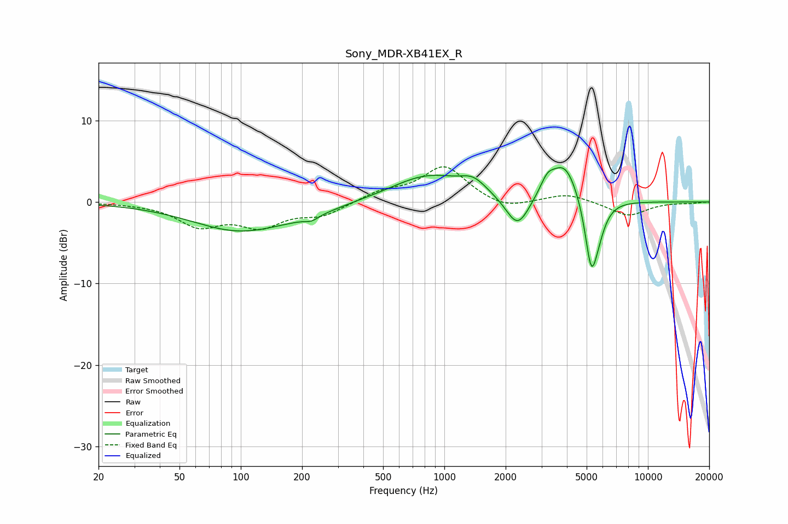

# Sony_MDR-XB41EX_R
See [usage instructions](https://github.com/jaakkopasanen/AutoEq#usage) for more options and info.

### Parametric EQs
Apply preamp of -4.3 dB when using parametric equalizer.

|   # | Type    |   Fc (Hz) |    Q |   Gain (dB) |
|-----|---------|-----------|------|-------------|
|   1 | Peaking |        98 | 0.6  |        -3.4 |
|   2 | Peaking |       219 | 0.9  |        -0.7 |
|   3 | Peaking |       223 | 4.38 |        -0.5 |
|   4 | Peaking |       835 | 0.78 |         3.3 |
|   5 | Peaking |      1388 | 2.24 |         1.5 |
|   6 | Peaking |      2291 | 2.43 |        -4   |
|   7 | Peaking |      3201 | 4.19 |         1.6 |
|   8 | Peaking |      3898 | 1.99 |         5   |
|   9 | Peaking |      5267 | 4.4  |        -8.1 |
|  10 | Peaking |      5690 | 3.58 |        -2.2 |

### Fixed Band EQs
When using fixed band (also called graphic) equalizer, apply preamp of **-4.4 dB** (if available) and set gains manually with these parameters.

|   # | Type    |   Fc (Hz) |    Q |   Gain (dB) |
|-----|---------|-----------|------|-------------|
|   1 | Peaking |        31 | 1.41 |        -0.1 |
|   2 | Peaking |        62 | 1.41 |        -2.7 |
|   3 | Peaking |       125 | 1.41 |        -2.7 |
|   4 | Peaking |       250 | 1.41 |        -1.5 |
|   5 | Peaking |       500 | 1.41 |         1.2 |
|   6 | Peaking |      1000 | 1.41 |         4.3 |
|   7 | Peaking |      2000 | 1.41 |        -1   |
|   8 | Peaking |      4000 | 1.41 |         1   |
|   9 | Peaking |      8000 | 1.41 |        -1.7 |
|  10 | Peaking |     16000 | 1.41 |        -0.1 |

### Graphs

