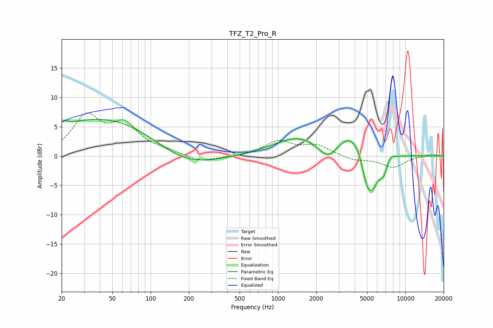

# TFZ_T2_Pro_R
See [usage instructions](https://github.com/jaakkopasanen/AutoEq#usage) for more options and info.

### Parametric EQs
Apply preamp of -6.3 dB when using parametric equalizer.

|   # | Type    |   Fc (Hz) |    Q |   Gain (dB) |
|-----|---------|-----------|------|-------------|
|   1 | Peaking |        21 | 5.41 |         0.8 |
|   2 | Peaking |        45 | 0.29 |         6.7 |
|   3 | Peaking |       179 | 0.57 |        -3.3 |
|   4 | Peaking |      1556 | 0.66 |         3.4 |
|   5 | Peaking |      2462 | 1.63 |        -3.6 |
|   6 | Peaking |      3946 | 1.15 |         4.9 |
|   7 | Peaking |      4951 | 3.74 |        -2.4 |
|   8 | Peaking |      5401 | 2.14 |        -7.3 |
|   9 | Peaking |      6784 | 4.58 |        -2.3 |
|  10 | Peaking |      7541 | 3.43 |         1.2 |

### Fixed Band EQs
When using fixed band (also called graphic) equalizer, apply preamp of **-7.4 dB** (if available) and set gains manually with these parameters.

|   # | Type    |   Fc (Hz) |    Q |   Gain (dB) |
|-----|---------|-----------|------|-------------|
|   1 | Peaking |        31 | 1.41 |         6.4 |
|   2 | Peaking |        62 | 1.41 |         4.8 |
|   3 | Peaking |       125 | 1.41 |         0.7 |
|   4 | Peaking |       250 | 1.41 |        -1.1 |
|   5 | Peaking |       500 | 1.41 |        -0.2 |
|   6 | Peaking |      1000 | 1.41 |         2.4 |
|   7 | Peaking |      2000 | 1.41 |         1.7 |
|   8 | Peaking |      4000 | 1.41 |        -0.7 |
|   9 | Peaking |      8000 | 1.41 |        -1.9 |
|  10 | Peaking |     16000 | 1.41 |         0.3 |

### Graphs

