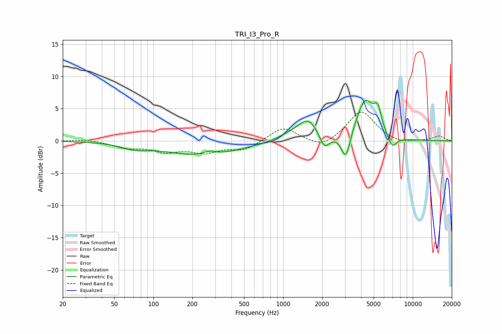

# TRI_I3_Pro_R
See [usage instructions](https://github.com/jaakkopasanen/AutoEq#usage) for more options and info.

### Parametric EQs
Apply preamp of -6.4 dB when using parametric equalizer.

|   # | Type    |   Fc (Hz) |    Q |   Gain (dB) |
|-----|---------|-----------|------|-------------|
|   1 | Peaking |        71 | 1.45 |        -0.8 |
|   2 | Peaking |       238 | 0.49 |        -2.2 |
|   3 | Peaking |       272 | 2.95 |         0.6 |
|   4 | Peaking |      1150 | 1.43 |         0.8 |
|   5 | Peaking |      1559 | 1.86 |         3   |
|   6 | Peaking |      2086 | 3.8  |        -2.3 |
|   7 | Peaking |      3049 | 4.01 |        -4.2 |
|   8 | Peaking |      4297 | 2    |         6.2 |
|   9 | Peaking |      5375 | 4.91 |         3   |
|  10 | Peaking |      6923 | 3.82 |        -2   |

### Fixed Band EQs
When using fixed band (also called graphic) equalizer, apply preamp of **-4.6 dB** (if available) and set gains manually with these parameters.

|   # | Type    |   Fc (Hz) |    Q |   Gain (dB) |
|-----|---------|-----------|------|-------------|
|   1 | Peaking |        31 | 1.41 |         0.3 |
|   2 | Peaking |        62 | 1.41 |        -1   |
|   3 | Peaking |       125 | 1.41 |        -1.4 |
|   4 | Peaking |       250 | 1.41 |        -1.6 |
|   5 | Peaking |       500 | 1.41 |        -1.4 |
|   6 | Peaking |      1000 | 1.41 |         2.2 |
|   7 | Peaking |      2000 | 1.41 |        -1.3 |
|   8 | Peaking |      4000 | 1.41 |         4.7 |
|   9 | Peaking |      8000 | 1.41 |        -0.6 |
|  10 | Peaking |     16000 | 1.41 |         0.7 |

### Graphs

