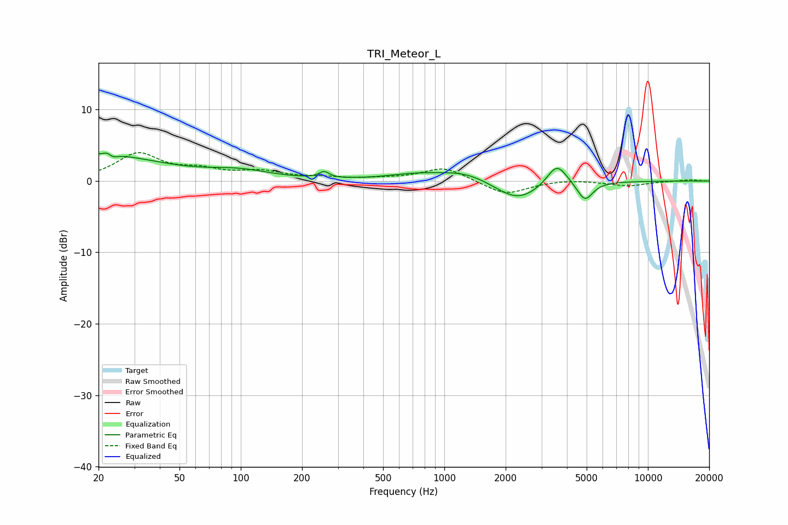

# TRI_Meteor_L
See [usage instructions](https://github.com/jaakkopasanen/AutoEq#usage) for more options and info.

### Parametric EQs
Apply preamp of -4.0 dB when using parametric equalizer.

|   # | Type    |   Fc (Hz) |    Q |   Gain (dB) |
|-----|---------|-----------|------|-------------|
|   1 | Peaking |        20 | 0.48 |         3.7 |
|   2 | Peaking |        23 | 5.93 |         2.8 |
|   3 | Peaking |        23 | 5.87 |        -2.9 |
|   4 | Peaking |        98 | 0.91 |         1.2 |
|   5 | Peaking |       256 | 5.93 |         0.9 |
|   6 | Peaking |       736 | 0.95 |         0.8 |
|   7 | Peaking |      1277 | 1.17 |         1.2 |
|   8 | Peaking |      2292 | 1.27 |        -2.9 |
|   9 | Peaking |      3574 | 2.86 |         3.1 |
|  10 | Peaking |      4903 | 3.62 |        -2.7 |

### Fixed Band EQs
When using fixed band (also called graphic) equalizer, apply preamp of **-4.1 dB** (if available) and set gains manually with these parameters.

|   # | Type    |   Fc (Hz) |    Q |   Gain (dB) |
|-----|---------|-----------|------|-------------|
|   1 | Peaking |        31 | 1.41 |         3.7 |
|   2 | Peaking |        62 | 1.41 |         1.3 |
|   3 | Peaking |       125 | 1.41 |         1.2 |
|   4 | Peaking |       250 | 1.41 |         0.4 |
|   5 | Peaking |       500 | 1.41 |         0.2 |
|   6 | Peaking |      1000 | 1.41 |         1.9 |
|   7 | Peaking |      2000 | 1.41 |        -2   |
|   8 | Peaking |      4000 | 1.41 |         0.2 |
|   9 | Peaking |      8000 | 1.41 |        -0.7 |
|  10 | Peaking |     16000 | 1.41 |         0.2 |

### Graphs

