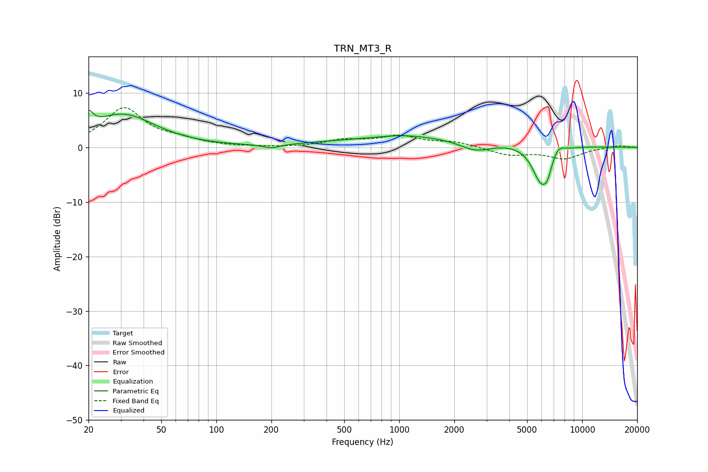

# TRN_MT3_R
See [usage instructions](https://github.com/jaakkopasanen/AutoEq#usage) for more options and info.

### Parametric EQs
Apply preamp of -6.9 dB when using parametric equalizer.

|   # | Type    |   Fc (Hz) |    Q |   Gain (dB) |
|-----|---------|-----------|------|-------------|
|   1 | Peaking |        20 | 5.98 |         2.8 |
|   2 | Peaking |        31 | 0.8  |         6   |
|   3 | Peaking |       200 | 3.14 |        -0.7 |
|   4 | Peaking |       329 | 0.41 |        -0.2 |
|   5 | Peaking |      1040 | 1.25 |         0.4 |
|   6 | Peaking |      1422 | 0.23 |         2   |
|   7 | Peaking |      2630 | 1.52 |        -2.1 |
|   8 | Peaking |      5949 | 2.81 |        -6.7 |
|   9 | Peaking |      6455 | 5.99 |        -2.2 |
|  10 | Peaking |      7397 | 4.2  |         1.5 |

### Fixed Band EQs
When using fixed band (also called graphic) equalizer, apply preamp of **-7.4 dB** (if available) and set gains manually with these parameters.

|   # | Type    |   Fc (Hz) |    Q |   Gain (dB) |
|-----|---------|-----------|------|-------------|
|   1 | Peaking |        31 | 1.41 |         7.1 |
|   2 | Peaking |        62 | 1.41 |         1.1 |
|   3 | Peaking |       125 | 1.41 |         0   |
|   4 | Peaking |       250 | 1.41 |        -0.1 |
|   5 | Peaking |       500 | 1.41 |         1.2 |
|   6 | Peaking |      1000 | 1.41 |         1.9 |
|   7 | Peaking |      2000 | 1.41 |         0.9 |
|   8 | Peaking |      4000 | 1.41 |        -1.4 |
|   9 | Peaking |      8000 | 1.41 |        -2   |
|  10 | Peaking |     16000 | 1.41 |         0.4 |

### Graphs

