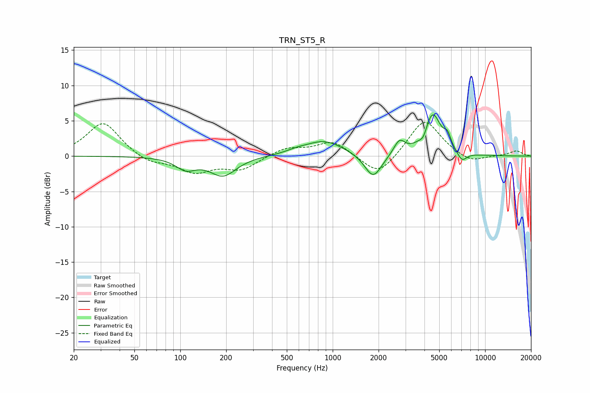

# TRN_ST5_R
See [usage instructions](https://github.com/jaakkopasanen/AutoEq#usage) for more options and info.

### Parametric EQs
Apply preamp of -5.9 dB when using parametric equalizer.

|   # | Type    |   Fc (Hz) |    Q |   Gain (dB) |
|-----|---------|-----------|------|-------------|
|   1 | Peaking |       109 | 2.2  |        -1.6 |
|   2 | Peaking |       191 | 1.64 |        -2.7 |
|   3 | Peaking |       581 | 2.13 |         0.3 |
|   4 | Peaking |       881 | 1.12 |         2.2 |
|   5 | Peaking |      1844 | 2.53 |        -3.5 |
|   6 | Peaking |      2740 | 3.86 |         2   |
|   7 | Peaking |      3943 | 6    |        -1.1 |
|   8 | Peaking |      4520 | 2.56 |         6   |
|   9 | Peaking |      5662 | 6    |         1.6 |
|  10 | Peaking |      7045 | 4.23 |        -1.4 |

### Fixed Band EQs
When using fixed band (also called graphic) equalizer, apply preamp of **-4.9 dB** (if available) and set gains manually with these parameters.

|   # | Type    |   Fc (Hz) |    Q |   Gain (dB) |
|-----|---------|-----------|------|-------------|
|   1 | Peaking |        31 | 1.41 |         4.9 |
|   2 | Peaking |        62 | 1.41 |        -1.1 |
|   3 | Peaking |       125 | 1.41 |        -2.2 |
|   4 | Peaking |       250 | 1.41 |        -1.8 |
|   5 | Peaking |       500 | 1.41 |         1.2 |
|   6 | Peaking |      1000 | 1.41 |         2.1 |
|   7 | Peaking |      2000 | 1.41 |        -3.1 |
|   8 | Peaking |      4000 | 1.41 |         5.4 |
|   9 | Peaking |      8000 | 1.41 |        -1.1 |
|  10 | Peaking |     16000 | 1.41 |         0.7 |

### Graphs

