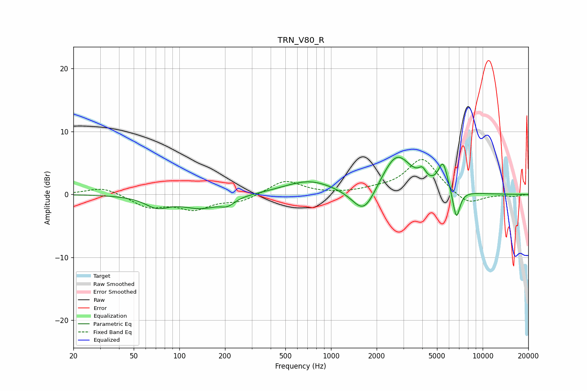

# TRN_V80_R
See [usage instructions](https://github.com/jaakkopasanen/AutoEq#usage) for more options and info.

### Parametric EQs
Apply preamp of -6.0 dB when using parametric equalizer.

|   # | Type    |   Fc (Hz) |    Q |   Gain (dB) |
|-----|---------|-----------|------|-------------|
|   1 | Peaking |        71 | 1.82 |        -1.7 |
|   2 | Peaking |       142 | 1.06 |        -2.4 |
|   3 | Peaking |       174 | 1.02 |         0.5 |
|   4 | Peaking |       208 | 2.99 |        -1.1 |
|   5 | Peaking |       715 | 0.86 |         2.2 |
|   6 | Peaking |      1651 | 1.81 |        -4.5 |
|   7 | Peaking |      2707 | 1.38 |         6.5 |
|   8 | Peaking |      4001 | 5.95 |         1.4 |
|   9 | Peaking |      5479 | 4.45 |         4.3 |
|  10 | Peaking |      6708 | 5.77 |        -4.8 |

### Fixed Band EQs
When using fixed band (also called graphic) equalizer, apply preamp of **-5.7 dB** (if available) and set gains manually with these parameters.

|   # | Type    |   Fc (Hz) |    Q |   Gain (dB) |
|-----|---------|-----------|------|-------------|
|   1 | Peaking |        31 | 1.41 |         1.2 |
|   2 | Peaking |        62 | 1.41 |        -1.9 |
|   3 | Peaking |       125 | 1.41 |        -2.1 |
|   4 | Peaking |       250 | 1.41 |        -1.1 |
|   5 | Peaking |       500 | 1.41 |         2.3 |
|   6 | Peaking |      1000 | 1.41 |        -0   |
|   7 | Peaking |      2000 | 1.41 |         0.6 |
|   8 | Peaking |      4000 | 1.41 |         5.7 |
|   9 | Peaking |      8000 | 1.41 |        -1.8 |
|  10 | Peaking |     16000 | 1.41 |        -0.3 |

### Graphs

