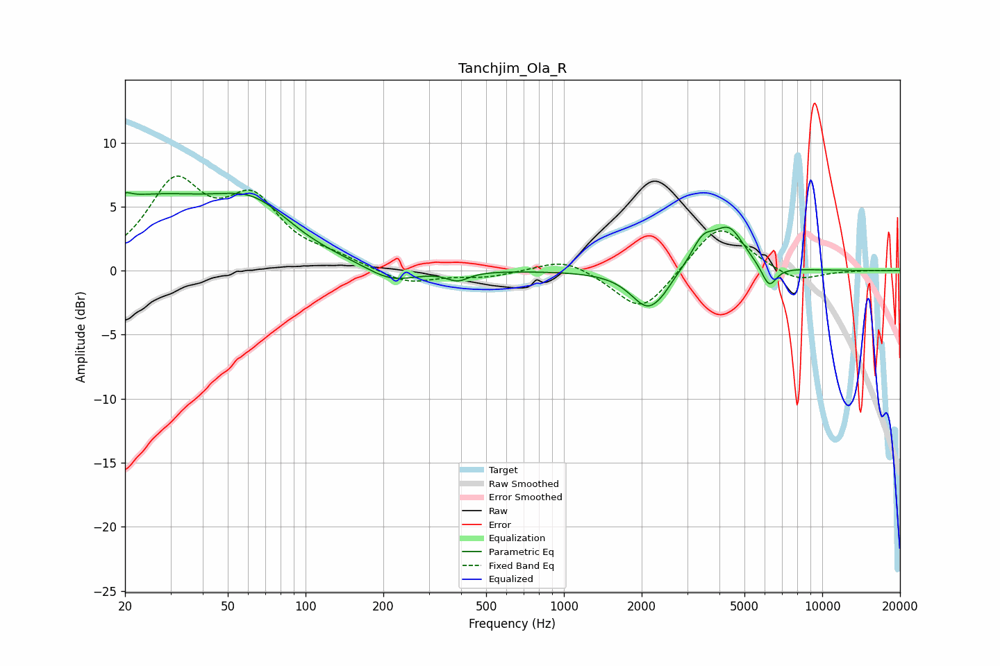

# Tanchjim_Ola_R
See [usage instructions](https://github.com/jaakkopasanen/AutoEq#usage) for more options and info.

### Parametric EQs
Apply preamp of -6.2 dB when using parametric equalizer.

|   # | Type    |   Fc (Hz) |    Q |   Gain (dB) |
|-----|---------|-----------|------|-------------|
|   1 | Peaking |        20 | 5.86 |         0.5 |
|   2 | Peaking |        24 | 0.4  |         5.4 |
|   3 | Peaking |        64 | 1.01 |         2.8 |
|   4 | Peaking |       214 | 1.47 |        -1.2 |
|   5 | Peaking |       388 | 3.35 |        -0.7 |
|   6 | Peaking |      2126 | 2.1  |        -3.1 |
|   7 | Peaking |      2428 | 5.11 |        -0.2 |
|   8 | Peaking |      3443 | 3.01 |         2.1 |
|   9 | Peaking |      4360 | 2.3  |         3.1 |
|  10 | Peaking |      6228 | 4.73 |        -1.7 |

### Fixed Band EQs
When using fixed band (also called graphic) equalizer, apply preamp of **-7.5 dB** (if available) and set gains manually with these parameters.

|   # | Type    |   Fc (Hz) |    Q |   Gain (dB) |
|-----|---------|-----------|------|-------------|
|   1 | Peaking |        31 | 1.41 |         6.4 |
|   2 | Peaking |        62 | 1.41 |         4.9 |
|   3 | Peaking |       125 | 1.41 |         0.8 |
|   4 | Peaking |       250 | 1.41 |        -1.1 |
|   5 | Peaking |       500 | 1.41 |        -0.5 |
|   6 | Peaking |      1000 | 1.41 |         1.1 |
|   7 | Peaking |      2000 | 1.41 |        -3.4 |
|   8 | Peaking |      4000 | 1.41 |         3.8 |
|   9 | Peaking |      8000 | 1.41 |        -1   |
|  10 | Peaking |     16000 | 1.41 |         0   |

### Graphs

