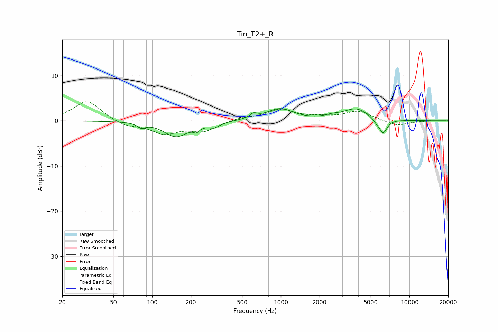

# Tin_T2+_R
See [usage instructions](https://github.com/jaakkopasanen/AutoEq#usage) for more options and info.

### Parametric EQs
Apply preamp of -2.8 dB when using parametric equalizer.

|   # | Type    |   Fc (Hz) |    Q |   Gain (dB) |
|-----|---------|-----------|------|-------------|
|   1 | Peaking |        82 | 4.96 |        -1   |
|   2 | Peaking |       153 | 1.52 |        -3.4 |
|   3 | Peaking |       221 | 5.97 |        -1   |
|   4 | Peaking |       303 | 3.09 |        -1.1 |
|   5 | Peaking |       613 | 4.8  |         1   |
|   6 | Peaking |       984 | 1.4  |         2.6 |
|   7 | Peaking |      2528 | 2.41 |         0.5 |
|   8 | Peaking |      3848 | 1.48 |         2.6 |
|   9 | Peaking |      5519 | 6    |        -0.6 |
|  10 | Peaking |      6237 | 4.4  |        -3.2 |

### Fixed Band EQs
When using fixed band (also called graphic) equalizer, apply preamp of **-4.3 dB** (if available) and set gains manually with these parameters.

|   # | Type    |   Fc (Hz) |    Q |   Gain (dB) |
|-----|---------|-----------|------|-------------|
|   1 | Peaking |        31 | 1.41 |         4.5 |
|   2 | Peaking |        62 | 1.41 |        -1.2 |
|   3 | Peaking |       125 | 1.41 |        -2.6 |
|   4 | Peaking |       250 | 1.41 |        -2.2 |
|   5 | Peaking |       500 | 1.41 |         0.7 |
|   6 | Peaking |      1000 | 1.41 |         2.4 |
|   7 | Peaking |      2000 | 1.41 |         0.6 |
|   8 | Peaking |      4000 | 1.41 |         2.1 |
|   9 | Peaking |      8000 | 1.41 |        -1.2 |
|  10 | Peaking |     16000 | 1.41 |         0   |

### Graphs

