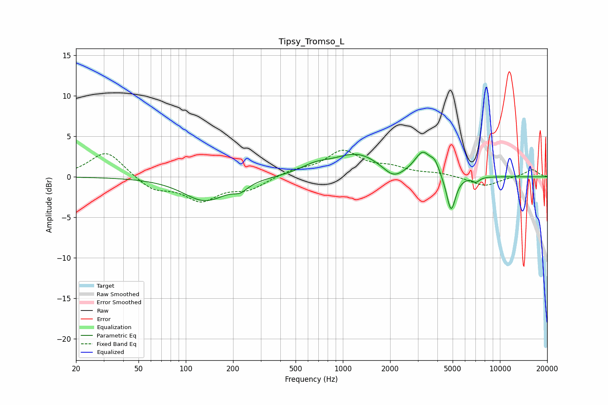

# Tipsy_Tromso_L
See [usage instructions](https://github.com/jaakkopasanen/AutoEq#usage) for more options and info.

### Parametric EQs
Apply preamp of -3.1 dB when using parametric equalizer.

|   # | Type    |   Fc (Hz) |    Q |   Gain (dB) |
|-----|---------|-----------|------|-------------|
|   1 | Peaking |       132 | 1.03 |        -2.9 |
|   2 | Peaking |       223 | 3.12 |        -0.9 |
|   3 | Peaking |       665 | 1.55 |         0.9 |
|   4 | Peaking |      1237 | 0.91 |         2.8 |
|   5 | Peaking |      2096 | 2.19 |        -1.4 |
|   6 | Peaking |      3039 | 2.68 |         0.3 |
|   7 | Peaking |      3237 | 2.88 |         2.5 |
|   8 | Peaking |      3851 | 4.94 |         1.2 |
|   9 | Peaking |      4886 | 4.81 |        -4.6 |
|  10 | Peaking |      7043 | 6    |        -0.6 |

### Fixed Band EQs
When using fixed band (also called graphic) equalizer, apply preamp of **-3.4 dB** (if available) and set gains manually with these parameters.

|   # | Type    |   Fc (Hz) |    Q |   Gain (dB) |
|-----|---------|-----------|------|-------------|
|   1 | Peaking |        31 | 1.41 |         3.2 |
|   2 | Peaking |        62 | 1.41 |        -1.6 |
|   3 | Peaking |       125 | 1.41 |        -2.7 |
|   4 | Peaking |       250 | 1.41 |        -1.4 |
|   5 | Peaking |       500 | 1.41 |         0.7 |
|   6 | Peaking |      1000 | 1.41 |         3   |
|   7 | Peaking |      2000 | 1.41 |         1   |
|   8 | Peaking |      4000 | 1.41 |         0.4 |
|   9 | Peaking |      8000 | 1.41 |        -1.2 |
|  10 | Peaking |     16000 | 1.41 |         0.9 |

### Graphs

