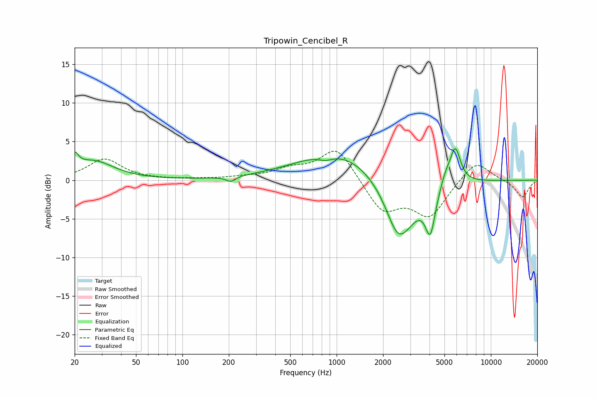

# Tripowin_Cencibel_R
See [usage instructions](https://github.com/jaakkopasanen/AutoEq#usage) for more options and info.

### Parametric EQs
Apply preamp of -4.2 dB when using parametric equalizer.

|   # | Type    |   Fc (Hz) |    Q |   Gain (dB) |
|-----|---------|-----------|------|-------------|
|   1 | Peaking |        20 | 5.99 |         1.9 |
|   2 | Peaking |        26 | 1.09 |         2.4 |
|   3 | Peaking |       206 | 4.64 |        -0.7 |
|   4 | Peaking |       848 | 3.07 |        -0.6 |
|   5 | Peaking |      1059 | 0.51 |         4   |
|   6 | Peaking |      2450 | 2.46 |        -1.7 |
|   7 | Peaking |      2627 | 1.26 |        -7.1 |
|   8 | Peaking |      4048 | 4.41 |        -5.3 |
|   9 | Peaking |      5075 | 4.12 |         1.5 |
|  10 | Peaking |      5873 | 3.99 |         4.7 |

### Fixed Band EQs
When using fixed band (also called graphic) equalizer, apply preamp of **-3.8 dB** (if available) and set gains manually with these parameters.

|   # | Type    |   Fc (Hz) |    Q |   Gain (dB) |
|-----|---------|-----------|------|-------------|
|   1 | Peaking |        31 | 1.41 |         2.7 |
|   2 | Peaking |        62 | 1.41 |         0   |
|   3 | Peaking |       125 | 1.41 |         0.1 |
|   4 | Peaking |       250 | 1.41 |         0.3 |
|   5 | Peaking |       500 | 1.41 |         1.2 |
|   6 | Peaking |      1000 | 1.41 |         4.3 |
|   7 | Peaking |      2000 | 1.41 |        -4.1 |
|   8 | Peaking |      4000 | 1.41 |        -4.5 |
|   9 | Peaking |      8000 | 1.41 |         2.7 |
|  10 | Peaking |     16000 | 1.41 |        -2.3 |

### Graphs

