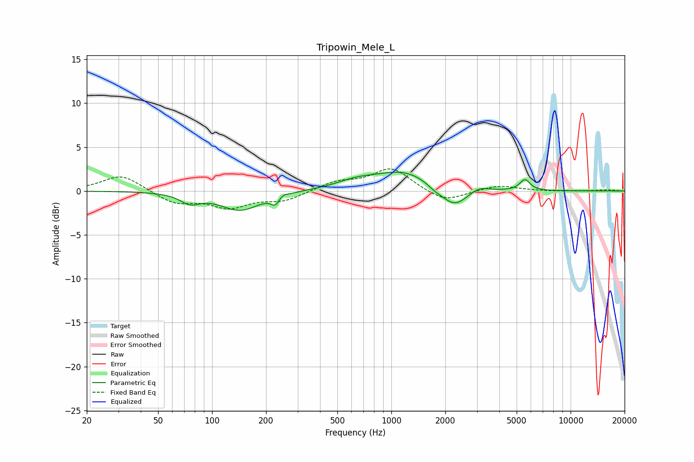

# Tripowin_Mele_L
See [usage instructions](https://github.com/jaakkopasanen/AutoEq#usage) for more options and info.

### Parametric EQs
Apply preamp of -2.2 dB when using parametric equalizer.

|   # | Type    |   Fc (Hz) |    Q |   Gain (dB) |
|-----|---------|-----------|------|-------------|
|   1 | Peaking |        75 | 2.66 |        -1.1 |
|   2 | Peaking |       143 | 1.26 |        -2.2 |
|   3 | Peaking |       226 | 5.99 |        -1   |
|   4 | Peaking |       247 | 6    |         0.4 |
|   5 | Peaking |       639 | 1.24 |         0.8 |
|   6 | Peaking |      1184 | 0.89 |         2.2 |
|   7 | Peaking |      1755 | 3.25 |        -0.5 |
|   8 | Peaking |      2243 | 1.95 |        -2.3 |
|   9 | Peaking |      3097 | 2.82 |         0.6 |
|  10 | Peaking |      5557 | 4.94 |         1.2 |

### Fixed Band EQs
When using fixed band (also called graphic) equalizer, apply preamp of **-2.6 dB** (if available) and set gains manually with these parameters.

|   # | Type    |   Fc (Hz) |    Q |   Gain (dB) |
|-----|---------|-----------|------|-------------|
|   1 | Peaking |        31 | 1.41 |         1.9 |
|   2 | Peaking |        62 | 1.41 |        -1.4 |
|   3 | Peaking |       125 | 1.41 |        -1.7 |
|   4 | Peaking |       250 | 1.41 |        -1   |
|   5 | Peaking |       500 | 1.41 |         1   |
|   6 | Peaking |      1000 | 1.41 |         2.6 |
|   7 | Peaking |      2000 | 1.41 |        -1.4 |
|   8 | Peaking |      4000 | 1.41 |         0.7 |
|   9 | Peaking |      8000 | 1.41 |        -0.1 |
|  10 | Peaking |     16000 | 1.41 |         0.1 |

### Graphs

