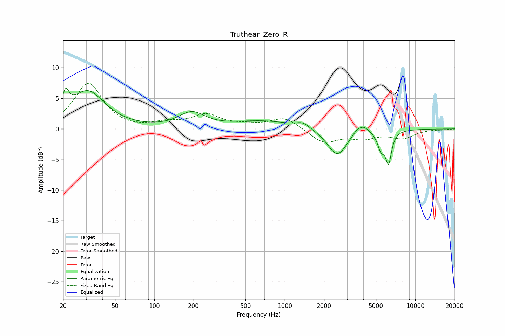

# Truthear_Zero_R
See [usage instructions](https://github.com/jaakkopasanen/AutoEq#usage) for more options and info.

### Parametric EQs
Apply preamp of -6.7 dB when using parametric equalizer.

|   # | Type    |   Fc (Hz) |    Q |   Gain (dB) |
|-----|---------|-----------|------|-------------|
|   1 | Peaking |        21 | 5.68 |         3.2 |
|   2 | Peaking |        31 | 1.09 |         6.1 |
|   3 | Peaking |       194 | 1.43 |         2.4 |
|   4 | Peaking |       696 | 0.61 |         1.3 |
|   5 | Peaking |      1382 | 2.77 |         0.9 |
|   6 | Peaking |      2531 | 1.86 |        -4.5 |
|   7 | Peaking |      3607 | 3.19 |         1.1 |
|   8 | Peaking |      4075 | 4    |         0.8 |
|   9 | Peaking |      5468 | 5.27 |        -2.7 |
|  10 | Peaking |      6247 | 6    |        -5   |

### Fixed Band EQs
When using fixed band (also called graphic) equalizer, apply preamp of **-7.6 dB** (if available) and set gains manually with these parameters.

|   # | Type    |   Fc (Hz) |    Q |   Gain (dB) |
|-----|---------|-----------|------|-------------|
|   1 | Peaking |        31 | 1.41 |         7.5 |
|   2 | Peaking |        62 | 1.41 |        -0.2 |
|   3 | Peaking |       125 | 1.41 |         0.8 |
|   4 | Peaking |       250 | 1.41 |         2.2 |
|   5 | Peaking |       500 | 1.41 |         0.5 |
|   6 | Peaking |      1000 | 1.41 |         1.9 |
|   7 | Peaking |      2000 | 1.41 |        -2.3 |
|   8 | Peaking |      4000 | 1.41 |        -1.3 |
|   9 | Peaking |      8000 | 1.41 |        -1.4 |
|  10 | Peaking |     16000 | 1.41 |        -0.1 |

### Graphs

