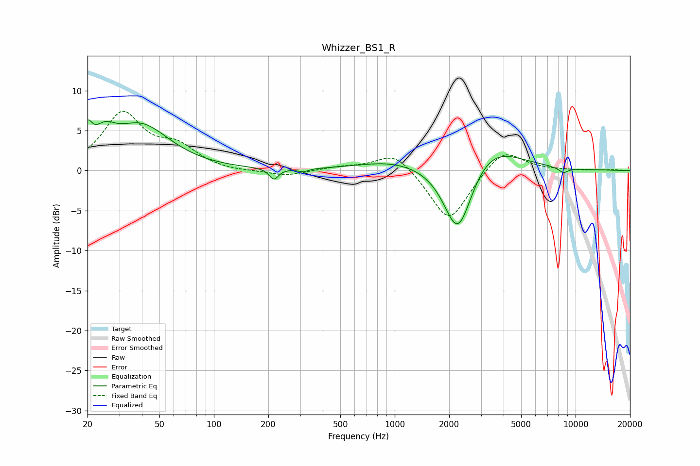

# Whizzer_BS1_R
See [usage instructions](https://github.com/jaakkopasanen/AutoEq#usage) for more options and info.

### Parametric EQs
Apply preamp of -6.4 dB when using parametric equalizer.

|   # | Type    |   Fc (Hz) |    Q |   Gain (dB) |
|-----|---------|-----------|------|-------------|
|   1 | Peaking |        20 | 5.85 |         2.9 |
|   2 | Peaking |        25 | 2.34 |         2.6 |
|   3 | Peaking |        40 | 0.89 |         5.5 |
|   4 | Peaking |       215 | 5.58 |        -1.4 |
|   5 | Peaking |       311 | 4.8  |        -0.4 |
|   6 | Peaking |       971 | 0.73 |         1.1 |
|   7 | Peaking |      2236 | 1.75 |        -7.4 |
|   8 | Peaking |      2244 | 1.93 |        -2   |
|   9 | Peaking |      3324 | 0.89 |         3.6 |
|  10 | Peaking |      8563 | 4.78 |        -0.7 |

### Fixed Band EQs
When using fixed band (also called graphic) equalizer, apply preamp of **-7.5 dB** (if available) and set gains manually with these parameters.

|   # | Type    |   Fc (Hz) |    Q |   Gain (dB) |
|-----|---------|-----------|------|-------------|
|   1 | Peaking |        31 | 1.41 |         7   |
|   2 | Peaking |        62 | 1.41 |         2.6 |
|   3 | Peaking |       125 | 1.41 |        -0.2 |
|   4 | Peaking |       250 | 1.41 |        -0.7 |
|   5 | Peaking |       500 | 1.41 |         0.4 |
|   6 | Peaking |      1000 | 1.41 |         2.5 |
|   7 | Peaking |      2000 | 1.41 |        -6.6 |
|   8 | Peaking |      4000 | 1.41 |         3   |
|   9 | Peaking |      8000 | 1.41 |         0   |
|  10 | Peaking |     16000 | 1.41 |         0.1 |

### Graphs

