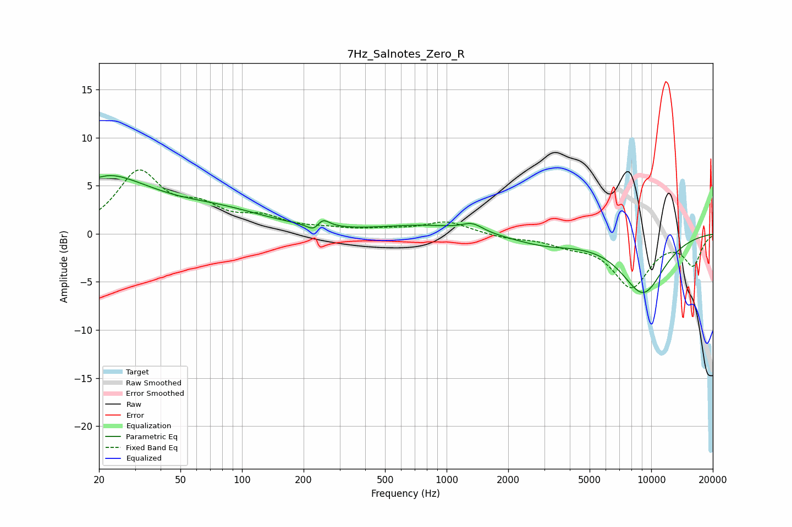

# 7Hz_Salnotes_Zero_R
See [usage instructions](https://github.com/jaakkopasanen/AutoEq#usage) for more options and info.

### Parametric EQs
Apply preamp of -6.2 dB when using parametric equalizer.

|   # | Type    |   Fc (Hz) |    Q |   Gain (dB) |
|-----|---------|-----------|------|-------------|
|   1 | Peaking |        20 | 0.56 |         5.9 |
|   2 | Peaking |        20 | 5.8  |        -3.6 |
|   3 | Peaking |        20 | 5.94 |         3.2 |
|   4 | Peaking |        80 | 0.58 |         1.8 |
|   5 | Peaking |       226 | 4.44 |        -0.9 |
|   6 | Peaking |       246 | 4.38 |         1.1 |
|   7 | Peaking |       778 | 0.69 |         0.9 |
|   8 | Peaking |      1337 | 2.77 |         0.8 |
|   9 | Peaking |      3003 | 0.88 |        -1   |
|  10 | Peaking |      9116 | 1.16 |        -6   |

### Fixed Band EQs
When using fixed band (also called graphic) equalizer, apply preamp of **-6.7 dB** (if available) and set gains manually with these parameters.

|   # | Type    |   Fc (Hz) |    Q |   Gain (dB) |
|-----|---------|-----------|------|-------------|
|   1 | Peaking |        31 | 1.41 |         6.2 |
|   2 | Peaking |        62 | 1.41 |         2.2 |
|   3 | Peaking |       125 | 1.41 |         1.4 |
|   4 | Peaking |       250 | 1.41 |         0.4 |
|   5 | Peaking |       500 | 1.41 |         0.3 |
|   6 | Peaking |      1000 | 1.41 |         1.3 |
|   7 | Peaking |      2000 | 1.41 |        -0.4 |
|   8 | Peaking |      4000 | 1.41 |        -0.9 |
|   9 | Peaking |      8000 | 1.41 |        -5.3 |
|  10 | Peaking |     16000 | 1.41 |        -3.1 |

### Graphs

