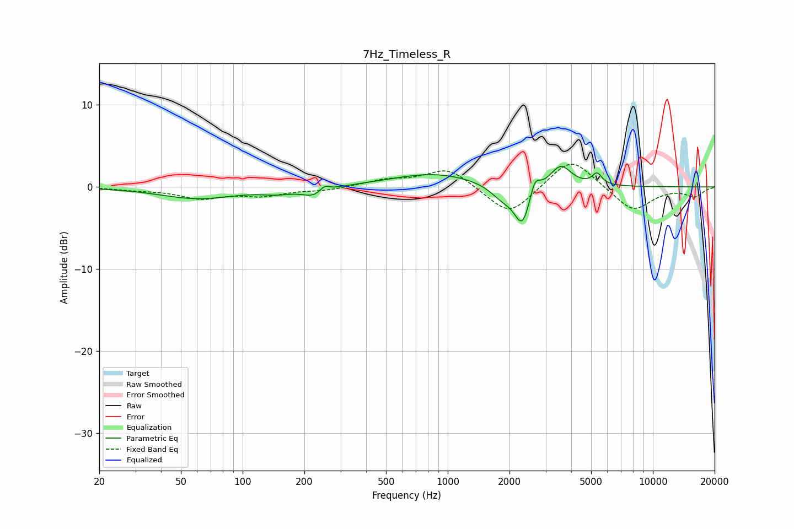

# 7Hz_Timeless_R
See [usage instructions](https://github.com/jaakkopasanen/AutoEq#usage) for more options and info.

### Parametric EQs
Apply preamp of -2.6 dB when using parametric equalizer.

|   # | Type    |   Fc (Hz) |    Q |   Gain (dB) |
|-----|---------|-----------|------|-------------|
|   1 | Peaking |        61 | 0.76 |        -1.4 |
|   2 | Peaking |       147 | 1.88 |        -0.5 |
|   3 | Peaking |       224 | 2.52 |        -1.1 |
|   4 | Peaking |       250 | 6    |         0.8 |
|   5 | Peaking |       857 | 0.68 |         1.6 |
|   6 | Peaking |      1850 | 2.36 |        -1.6 |
|   7 | Peaking |      2314 | 3.61 |        -4.7 |
|   8 | Peaking |      2658 | 6    |         2.1 |
|   9 | Peaking |      3554 | 2.76 |         2.6 |
|  10 | Peaking |      5345 | 6    |         1.4 |

### Fixed Band EQs
When using fixed band (also called graphic) equalizer, apply preamp of **-2.9 dB** (if available) and set gains manually with these parameters.

|   # | Type    |   Fc (Hz) |    Q |   Gain (dB) |
|-----|---------|-----------|------|-------------|
|   1 | Peaking |        31 | 1.41 |        -0.3 |
|   2 | Peaking |        62 | 1.41 |        -1.3 |
|   3 | Peaking |       125 | 1.41 |        -0.9 |
|   4 | Peaking |       250 | 1.41 |        -0.4 |
|   5 | Peaking |       500 | 1.41 |         0.8 |
|   6 | Peaking |      1000 | 1.41 |         2.3 |
|   7 | Peaking |      2000 | 1.41 |        -3.7 |
|   8 | Peaking |      4000 | 1.41 |         3.8 |
|   9 | Peaking |      8000 | 1.41 |        -3   |
|  10 | Peaking |     16000 | 1.41 |        -1.1 |

### Graphs

