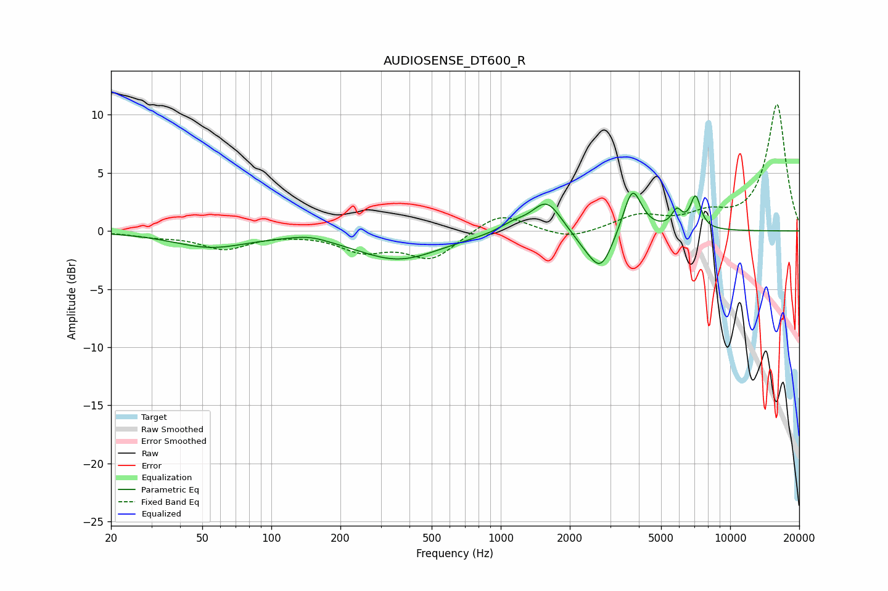

# AUDIOSENSE_DT600_R
See [usage instructions](https://github.com/jaakkopasanen/AutoEq#usage) for more options and info.

### Parametric EQs
Apply preamp of -3.3 dB when using parametric equalizer.

|   # | Type    |   Fc (Hz) |    Q |   Gain (dB) |
|-----|---------|-----------|------|-------------|
|   1 | Peaking |        54 | 0.86 |        -1.3 |
|   2 | Peaking |       146 | 1.81 |         0.4 |
|   3 | Peaking |       358 | 0.77 |        -2.4 |
|   4 | Peaking |      1130 | 2.32 |         0.6 |
|   5 | Peaking |      1588 | 2.18 |         2.8 |
|   6 | Peaking |      2348 | 2.04 |        -0.9 |
|   7 | Peaking |      2739 | 2.71 |        -3.1 |
|   8 | Peaking |      3747 | 3.51 |         4   |
|   9 | Peaking |      5855 | 5.99 |         1.4 |
|  10 | Peaking |      7070 | 5.95 |         2.8 |

### Fixed Band EQs
When using fixed band (also called graphic) equalizer, apply preamp of **-11.0 dB** (if available) and set gains manually with these parameters.

|   # | Type    |   Fc (Hz) |    Q |   Gain (dB) |
|-----|---------|-----------|------|-------------|
|   1 | Peaking |        31 | 1.41 |        -0.4 |
|   2 | Peaking |        62 | 1.41 |        -1.5 |
|   3 | Peaking |       125 | 1.41 |        -0.1 |
|   4 | Peaking |       250 | 1.41 |        -1.5 |
|   5 | Peaking |       500 | 1.41 |        -2.3 |
|   6 | Peaking |      1000 | 1.41 |         1.7 |
|   7 | Peaking |      2000 | 1.41 |        -0.8 |
|   8 | Peaking |      4000 | 1.41 |         1.3 |
|   9 | Peaking |      8000 | 1.41 |         1.2 |
|  10 | Peaking |     16000 | 1.41 |        10.9 |

### Graphs

