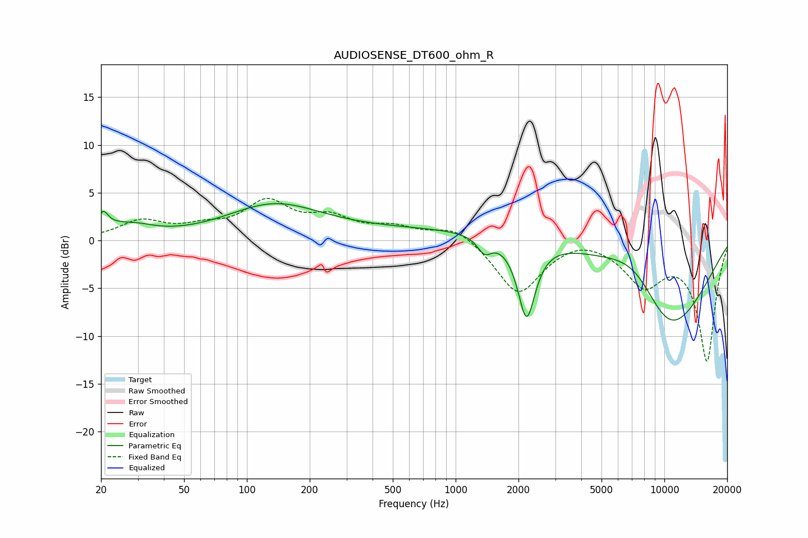

# AUDIOSENSE_DT600_ohm_R
See [usage instructions](https://github.com/jaakkopasanen/AutoEq#usage) for more options and info.

### Parametric EQs
Apply preamp of -4.0 dB when using parametric equalizer.

|   # | Type    |   Fc (Hz) |    Q |   Gain (dB) |
|-----|---------|-----------|------|-------------|
|   1 | Peaking |        20 | 1.4  |        -1   |
|   2 | Peaking |        20 | 5.96 |         1.7 |
|   3 | Peaking |        22 | 1.14 |         2   |
|   4 | Peaking |        30 | 1.68 |         0.5 |
|   5 | Peaking |       134 | 0.62 |         3.5 |
|   6 | Peaking |      1375 | 4.19 |        -1.6 |
|   7 | Peaking |      1379 | 0.18 |         1.3 |
|   8 | Peaking |      2187 | 3.34 |        -8.3 |
|   9 | Peaking |      7398 | 0.86 |         5.2 |
|  10 | Peaking |     10000 | 0.56 |       -11.7 |

### Fixed Band EQs
When using fixed band (also called graphic) equalizer, apply preamp of **-4.5 dB** (if available) and set gains manually with these parameters.

|   # | Type    |   Fc (Hz) |    Q |   Gain (dB) |
|-----|---------|-----------|------|-------------|
|   1 | Peaking |        31 | 1.41 |         1.9 |
|   2 | Peaking |        62 | 1.41 |         1   |
|   3 | Peaking |       125 | 1.41 |         3.7 |
|   4 | Peaking |       250 | 1.41 |         2   |
|   5 | Peaking |       500 | 1.41 |         1.2 |
|   6 | Peaking |      1000 | 1.41 |         1.6 |
|   7 | Peaking |      2000 | 1.41 |        -5.6 |
|   8 | Peaking |      4000 | 1.41 |         0.7 |
|   9 | Peaking |      8000 | 1.41 |        -4.2 |
|  10 | Peaking |     16000 | 1.41 |       -12.5 |

### Graphs

