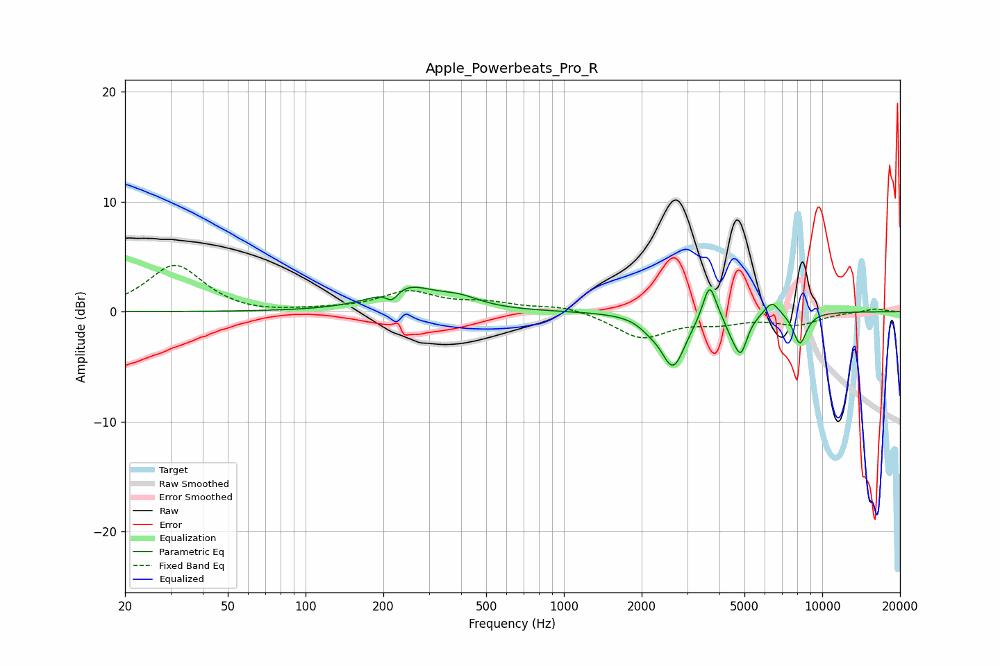

# Apple_Powerbeats_Pro_R
See [usage instructions](https://github.com/jaakkopasanen/AutoEq#usage) for more options and info.

### Parametric EQs
Apply preamp of -2.3 dB when using parametric equalizer.

|   # | Type    |   Fc (Hz) |    Q |   Gain (dB) |
|-----|---------|-----------|------|-------------|
|   1 | Peaking |       216 | 6    |        -1   |
|   2 | Peaking |       244 | 1.29 |         2.2 |
|   3 | Peaking |       395 | 1.76 |         0.8 |
|   4 | Peaking |      2139 | 3.59 |        -0.6 |
|   5 | Peaking |      2647 | 3    |        -4.9 |
|   6 | Peaking |      3661 | 5.59 |         3.4 |
|   7 | Peaking |      4436 | 6    |        -0.9 |
|   8 | Peaking |      4837 | 5.4  |        -3.4 |
|   9 | Peaking |      6389 | 4.73 |         1.3 |
|  10 | Peaking |      8196 | 5.04 |        -2.9 |

### Fixed Band EQs
When using fixed band (also called graphic) equalizer, apply preamp of **-4.3 dB** (if available) and set gains manually with these parameters.

|   # | Type    |   Fc (Hz) |    Q |   Gain (dB) |
|-----|---------|-----------|------|-------------|
|   1 | Peaking |        31 | 1.41 |         4.2 |
|   2 | Peaking |        62 | 1.41 |        -0.3 |
|   3 | Peaking |       125 | 1.41 |         0.1 |
|   4 | Peaking |       250 | 1.41 |         1.7 |
|   5 | Peaking |       500 | 1.41 |         0.7 |
|   6 | Peaking |      1000 | 1.41 |         0.6 |
|   7 | Peaking |      2000 | 1.41 |        -2.3 |
|   8 | Peaking |      4000 | 1.41 |        -0.8 |
|   9 | Peaking |      8000 | 1.41 |        -1.1 |
|  10 | Peaking |     16000 | 1.41 |         0.3 |

### Graphs

