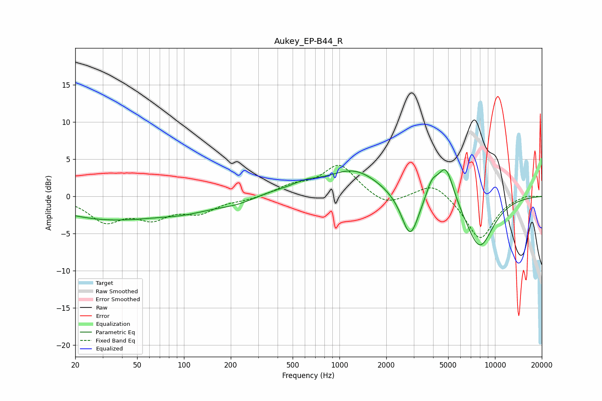

# Aukey_EP-B44_R
See [usage instructions](https://github.com/jaakkopasanen/AutoEq#usage) for more options and info.

### Parametric EQs
Apply preamp of -3.7 dB when using parametric equalizer.

|   # | Type    |   Fc (Hz) |    Q |   Gain (dB) |
|-----|---------|-----------|------|-------------|
|   1 | Peaking |        33 | 0.4  |        -3   |
|   2 | Peaking |       103 | 0.83 |        -1   |
|   3 | Peaking |       236 | 0.89 |        -1.7 |
|   4 | Peaking |       300 | 0.76 |         1.4 |
|   5 | Peaking |       610 | 1.54 |         0.9 |
|   6 | Peaking |      1243 | 0.84 |         3.5 |
|   7 | Peaking |      2848 | 2.54 |        -6.1 |
|   8 | Peaking |      3926 | 3.73 |         2.2 |
|   9 | Peaking |      4835 | 2.68 |         5.1 |
|  10 | Peaking |      7946 | 1.43 |        -7   |

### Fixed Band EQs
When using fixed band (also called graphic) equalizer, apply preamp of **-4.3 dB** (if available) and set gains manually with these parameters.

|   # | Type    |   Fc (Hz) |    Q |   Gain (dB) |
|-----|---------|-----------|------|-------------|
|   1 | Peaking |        31 | 1.41 |        -3.1 |
|   2 | Peaking |        62 | 1.41 |        -2.5 |
|   3 | Peaking |       125 | 1.41 |        -1.9 |
|   4 | Peaking |       250 | 1.41 |        -0.4 |
|   5 | Peaking |       500 | 1.41 |         1.2 |
|   6 | Peaking |      1000 | 1.41 |         4.2 |
|   7 | Peaking |      2000 | 1.41 |        -1.5 |
|   8 | Peaking |      4000 | 1.41 |         2.1 |
|   9 | Peaking |      8000 | 1.41 |        -5.8 |
|  10 | Peaking |     16000 | 1.41 |         0.3 |

### Graphs

