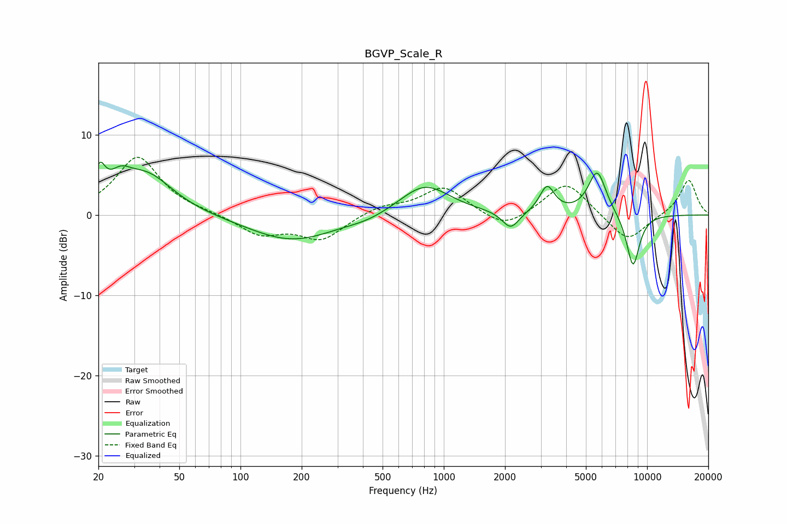

# BGVP_Scale_R
See [usage instructions](https://github.com/jaakkopasanen/AutoEq#usage) for more options and info.

### Parametric EQs
Apply preamp of -6.7 dB when using parametric equalizer.

|   # | Type    |   Fc (Hz) |    Q |   Gain (dB) |
|-----|---------|-----------|------|-------------|
|   1 | Peaking |        20 | 5.22 |         3.7 |
|   2 | Peaking |        26 | 2.63 |         2.3 |
|   3 | Peaking |        35 | 1.07 |         4.9 |
|   4 | Peaking |       179 | 0.66 |        -3.3 |
|   5 | Peaking |       425 | 1.49 |        -0.5 |
|   6 | Peaking |       806 | 1.15 |         3.9 |
|   7 | Peaking |      2133 | 3.43 |        -2.2 |
|   8 | Peaking |      3221 | 3.85 |         3.3 |
|   9 | Peaking |      5683 | 3.1  |         5.5 |
|  10 | Peaking |      8525 | 3.93 |        -6.7 |

### Fixed Band EQs
When using fixed band (also called graphic) equalizer, apply preamp of **-7.3 dB** (if available) and set gains manually with these parameters.

|   # | Type    |   Fc (Hz) |    Q |   Gain (dB) |
|-----|---------|-----------|------|-------------|
|   1 | Peaking |        31 | 1.41 |         7.2 |
|   2 | Peaking |        62 | 1.41 |         0.2 |
|   3 | Peaking |       125 | 1.41 |        -2.4 |
|   4 | Peaking |       250 | 1.41 |        -3   |
|   5 | Peaking |       500 | 1.41 |         1.1 |
|   6 | Peaking |      1000 | 1.41 |         3.5 |
|   7 | Peaking |      2000 | 1.41 |        -2   |
|   8 | Peaking |      4000 | 1.41 |         4.3 |
|   9 | Peaking |      8000 | 1.41 |        -3.5 |
|  10 | Peaking |     16000 | 1.41 |         4.5 |

### Graphs

