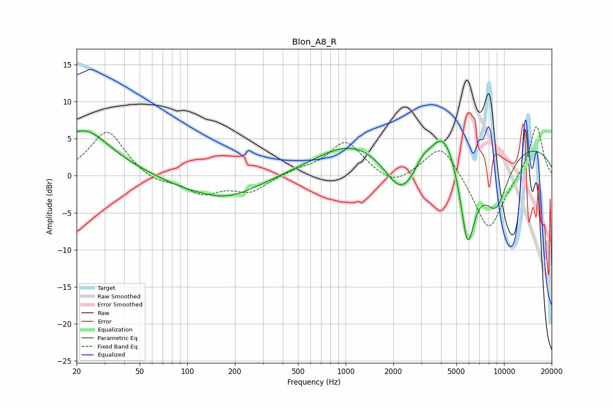

# Blon_A8_R
See [usage instructions](https://github.com/jaakkopasanen/AutoEq#usage) for more options and info.

### Parametric EQs
Apply preamp of -6.2 dB when using parametric equalizer.

|   # | Type    |   Fc (Hz) |    Q |   Gain (dB) |
|-----|---------|-----------|------|-------------|
|   1 | Peaking |        22 | 0.82 |         6.2 |
|   2 | Peaking |        86 | 1.09 |        -0.5 |
|   3 | Peaking |       172 | 0.67 |        -3   |
|   4 | Peaking |      1103 | 0.6  |         4.2 |
|   5 | Peaking |      2256 | 1.35 |        -5.8 |
|   6 | Peaking |      3051 | 3.3  |         1   |
|   7 | Peaking |      4190 | 1.66 |         4.9 |
|   8 | Peaking |      5891 | 2.67 |       -12.4 |
|   9 | Peaking |      8900 | 1.5  |        -7.7 |
|  10 | Peaking |     10000 | 0.23 |         4.8 |

### Fixed Band EQs
When using fixed band (also called graphic) equalizer, apply preamp of **-6.7 dB** (if available) and set gains manually with these parameters.

|   # | Type    |   Fc (Hz) |    Q |   Gain (dB) |
|-----|---------|-----------|------|-------------|
|   1 | Peaking |        31 | 1.41 |         6.1 |
|   2 | Peaking |        62 | 1.41 |        -1   |
|   3 | Peaking |       125 | 1.41 |        -2.3 |
|   4 | Peaking |       250 | 1.41 |        -2.1 |
|   5 | Peaking |       500 | 1.41 |         0.7 |
|   6 | Peaking |      1000 | 1.41 |         4.6 |
|   7 | Peaking |      2000 | 1.41 |        -1.7 |
|   8 | Peaking |      4000 | 1.41 |         4.6 |
|   9 | Peaking |      8000 | 1.41 |        -7.8 |
|  10 | Peaking |     16000 | 1.41 |         7   |

### Graphs

