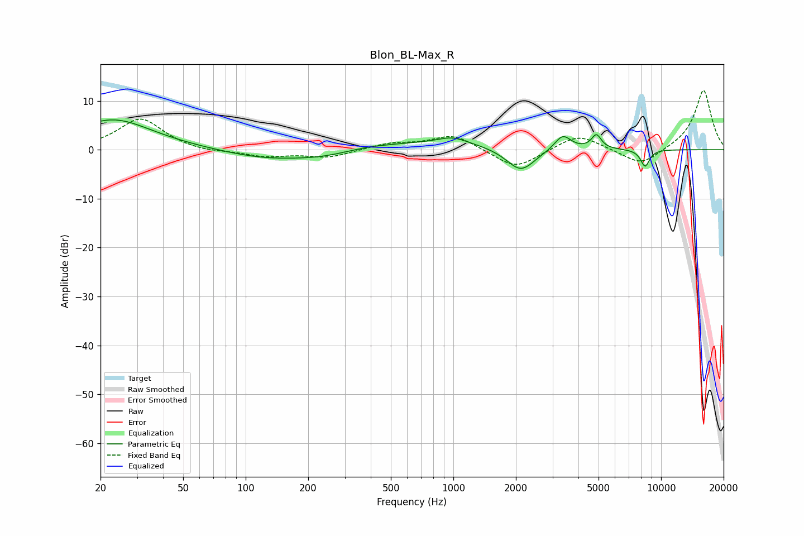

# Blon_BL-Max_R
See [usage instructions](https://github.com/jaakkopasanen/AutoEq#usage) for more options and info.

### Parametric EQs
Apply preamp of -6.2 dB when using parametric equalizer.

|   # | Type    |   Fc (Hz) |    Q |   Gain (dB) |
|-----|---------|-----------|------|-------------|
|   1 | Peaking |        23 | 0.75 |         6.2 |
|   2 | Peaking |       127 | 0.63 |        -2.8 |
|   3 | Peaking |       237 | 0.93 |        -1.6 |
|   4 | Peaking |       390 | 3.62 |         0.1 |
|   5 | Peaking |       412 | 0.19 |         1.9 |
|   6 | Peaking |       990 | 2.05 |         1.4 |
|   7 | Peaking |      2110 | 1.98 |        -5.1 |
|   8 | Peaking |      3362 | 3.62 |         3.1 |
|   9 | Peaking |      4882 | 6    |         2.8 |
|  10 | Peaking |      8372 | 6    |        -3.5 |

### Fixed Band EQs
When using fixed band (also called graphic) equalizer, apply preamp of **-12.2 dB** (if available) and set gains manually with these parameters.

|   # | Type    |   Fc (Hz) |    Q |   Gain (dB) |
|-----|---------|-----------|------|-------------|
|   1 | Peaking |        31 | 1.41 |         6.4 |
|   2 | Peaking |        62 | 1.41 |        -0.6 |
|   3 | Peaking |       125 | 1.41 |        -1.3 |
|   4 | Peaking |       250 | 1.41 |        -1.6 |
|   5 | Peaking |       500 | 1.41 |         1.2 |
|   6 | Peaking |      1000 | 1.41 |         3.1 |
|   7 | Peaking |      2000 | 1.41 |        -4.1 |
|   8 | Peaking |      4000 | 1.41 |         3.3 |
|   9 | Peaking |      8000 | 1.41 |        -3.5 |
|  10 | Peaking |     16000 | 1.41 |        12.3 |

### Graphs

