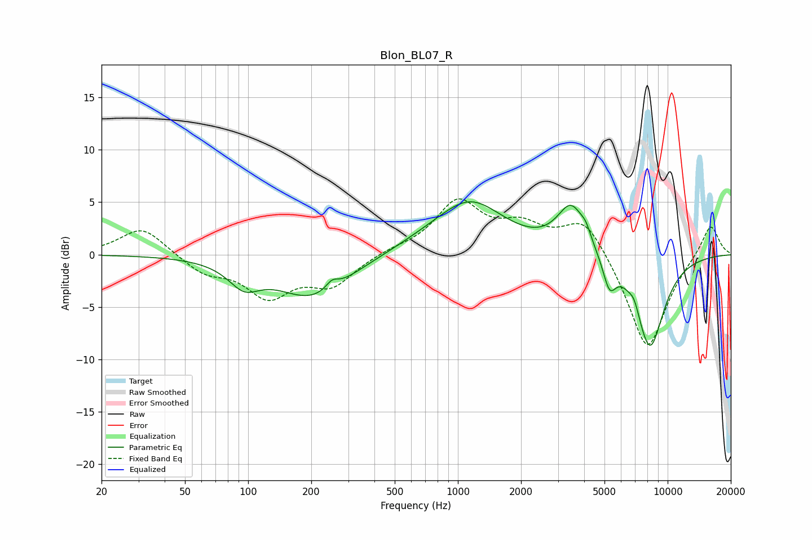

# Blon_BL07_R
See [usage instructions](https://github.com/jaakkopasanen/AutoEq#usage) for more options and info.

### Parametric EQs
Apply preamp of -5.1 dB when using parametric equalizer.

|   # | Type    |   Fc (Hz) |    Q |   Gain (dB) |
|-----|---------|-----------|------|-------------|
|   1 | Peaking |        96 | 1.93 |        -2.1 |
|   2 | Peaking |       203 | 0.81 |        -4.1 |
|   3 | Peaking |       251 | 4.72 |         0.9 |
|   4 | Peaking |       678 | 0.84 |         0.6 |
|   5 | Peaking |      1146 | 0.87 |         4.9 |
|   6 | Peaking |      3477 | 2.11 |         4.5 |
|   7 | Peaking |      4078 | 6    |         0.8 |
|   8 | Peaking |      5279 | 4.45 |        -2.8 |
|   9 | Peaking |      6930 | 6    |         0.9 |
|  10 | Peaking |      8226 | 1.87 |        -9   |

### Fixed Band EQs
When using fixed band (also called graphic) equalizer, apply preamp of **-5.4 dB** (if available) and set gains manually with these parameters.

|   # | Type    |   Fc (Hz) |    Q |   Gain (dB) |
|-----|---------|-----------|------|-------------|
|   1 | Peaking |        31 | 1.41 |         2.7 |
|   2 | Peaking |        62 | 1.41 |        -1.6 |
|   3 | Peaking |       125 | 1.41 |        -3.7 |
|   4 | Peaking |       250 | 1.41 |        -2.7 |
|   5 | Peaking |       500 | 1.41 |         0.4 |
|   6 | Peaking |      1000 | 1.41 |         4.9 |
|   7 | Peaking |      2000 | 1.41 |         2.3 |
|   8 | Peaking |      4000 | 1.41 |         3.7 |
|   9 | Peaking |      8000 | 1.41 |        -9.3 |
|  10 | Peaking |     16000 | 1.41 |         3.1 |

### Graphs

