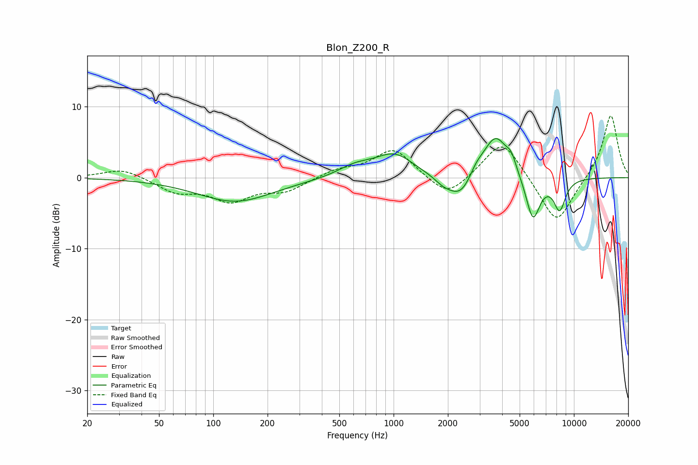

# Blon_Z200_R
See [usage instructions](https://github.com/jaakkopasanen/AutoEq#usage) for more options and info.

### Parametric EQs
Apply preamp of -5.6 dB when using parametric equalizer.

|   # | Type    |   Fc (Hz) |    Q |   Gain (dB) |
|-----|---------|-----------|------|-------------|
|   1 | Peaking |       132 | 0.67 |        -3.4 |
|   2 | Peaking |       610 | 1.46 |         1.4 |
|   3 | Peaking |      1012 | 1.3  |         3.2 |
|   4 | Peaking |      1878 | 3.18 |        -0.6 |
|   5 | Peaking |      2383 | 1.75 |        -4   |
|   6 | Peaking |      2856 | 3.12 |         1.7 |
|   7 | Peaking |      3678 | 1.97 |         6.3 |
|   8 | Peaking |      4495 | 5.3  |         1.6 |
|   9 | Peaking |      5923 | 3.46 |        -6.3 |
|  10 | Peaking |      8332 | 4    |        -4.3 |

### Fixed Band EQs
When using fixed band (also called graphic) equalizer, apply preamp of **-8.8 dB** (if available) and set gains manually with these parameters.

|   # | Type    |   Fc (Hz) |    Q |   Gain (dB) |
|-----|---------|-----------|------|-------------|
|   1 | Peaking |        31 | 1.41 |         1.3 |
|   2 | Peaking |        62 | 1.41 |        -1.9 |
|   3 | Peaking |       125 | 1.41 |        -3   |
|   4 | Peaking |       250 | 1.41 |        -1.8 |
|   5 | Peaking |       500 | 1.41 |         1   |
|   6 | Peaking |      1000 | 1.41 |         4.1 |
|   7 | Peaking |      2000 | 1.41 |        -3.1 |
|   8 | Peaking |      4000 | 1.41 |         5.6 |
|   9 | Peaking |      8000 | 1.41 |        -6.9 |
|  10 | Peaking |     16000 | 1.41 |         9   |

### Graphs

