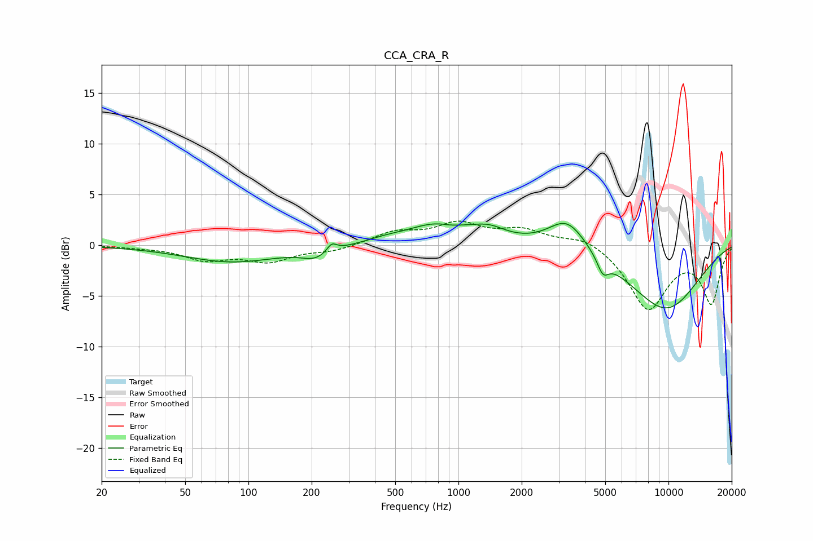

# CCA_CRA_R
See [usage instructions](https://github.com/jaakkopasanen/AutoEq#usage) for more options and info.

### Parametric EQs
Apply preamp of -2.2 dB when using parametric equalizer.

|   # | Type    |   Fc (Hz) |    Q |   Gain (dB) |
|-----|---------|-----------|------|-------------|
|   1 | Peaking |        84 | 0.61 |        -1.7 |
|   2 | Peaking |       209 | 2.13 |        -1   |
|   3 | Peaking |       249 | 6    |         0.8 |
|   4 | Peaking |       448 | 1.63 |         0.3 |
|   5 | Peaking |       831 | 0.94 |         2.2 |
|   6 | Peaking |       922 | 2.24 |        -0.5 |
|   7 | Peaking |      1403 | 1.83 |         0.9 |
|   8 | Peaking |      3294 | 1.56 |         3.1 |
|   9 | Peaking |      4871 | 5.13 |        -1.6 |
|  10 | Peaking |      9650 | 0.68 |        -6.3 |

### Fixed Band EQs
When using fixed band (also called graphic) equalizer, apply preamp of **-2.5 dB** (if available) and set gains manually with these parameters.

|   # | Type    |   Fc (Hz) |    Q |   Gain (dB) |
|-----|---------|-----------|------|-------------|
|   1 | Peaking |        31 | 1.41 |        -0.1 |
|   2 | Peaking |        62 | 1.41 |        -1.3 |
|   3 | Peaking |       125 | 1.41 |        -1.5 |
|   4 | Peaking |       250 | 1.41 |        -0.6 |
|   5 | Peaking |       500 | 1.41 |         1.2 |
|   6 | Peaking |      1000 | 1.41 |         1.9 |
|   7 | Peaking |      2000 | 1.41 |         1.4 |
|   8 | Peaking |      4000 | 1.41 |         1   |
|   9 | Peaking |      8000 | 1.41 |        -6.3 |
|  10 | Peaking |     16000 | 1.41 |        -5.6 |

### Graphs

