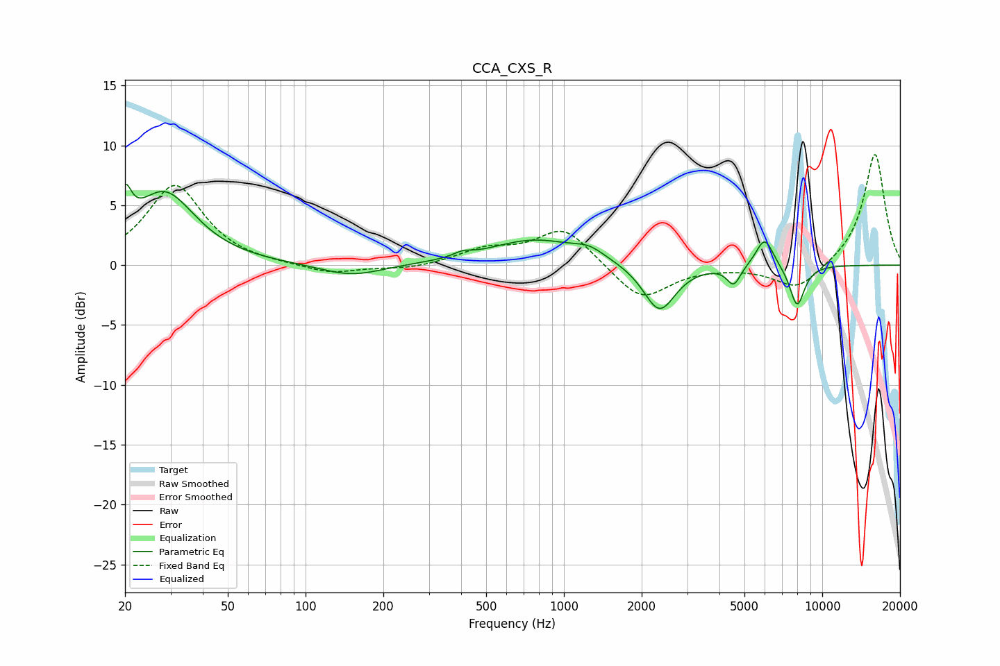

# CCA_CXS_R
See [usage instructions](https://github.com/jaakkopasanen/AutoEq#usage) for more options and info.

### Parametric EQs
Apply preamp of -6.8 dB when using parametric equalizer.

|   # | Type    |   Fc (Hz) |    Q |   Gain (dB) |
|-----|---------|-----------|------|-------------|
|   1 | Peaking |        20 | 5.88 |         3.3 |
|   2 | Peaking |        28 | 1.19 |         6   |
|   3 | Peaking |       151 | 1.18 |        -1   |
|   4 | Peaking |       405 | 4.25 |         0.4 |
|   5 | Peaking |       768 | 0.81 |         2.1 |
|   6 | Peaking |      1251 | 2.37 |         0.7 |
|   7 | Peaking |      2343 | 2.28 |        -4   |
|   8 | Peaking |      4543 | 5.29 |        -1.6 |
|   9 | Peaking |      5988 | 4.01 |         2.5 |
|  10 | Peaking |      7994 | 4.53 |        -3.5 |

### Fixed Band EQs
When using fixed band (also called graphic) equalizer, apply preamp of **-9.3 dB** (if available) and set gains manually with these parameters.

|   # | Type    |   Fc (Hz) |    Q |   Gain (dB) |
|-----|---------|-----------|------|-------------|
|   1 | Peaking |        31 | 1.41 |         6.7 |
|   2 | Peaking |        62 | 1.41 |        -0   |
|   3 | Peaking |       125 | 1.41 |        -0.8 |
|   4 | Peaking |       250 | 1.41 |        -0.4 |
|   5 | Peaking |       500 | 1.41 |         1.2 |
|   6 | Peaking |      1000 | 1.41 |         3.1 |
|   7 | Peaking |      2000 | 1.41 |        -3   |
|   8 | Peaking |      4000 | 1.41 |        -0.1 |
|   9 | Peaking |      8000 | 1.41 |        -2.1 |
|  10 | Peaking |     16000 | 1.41 |         9.4 |

### Graphs

