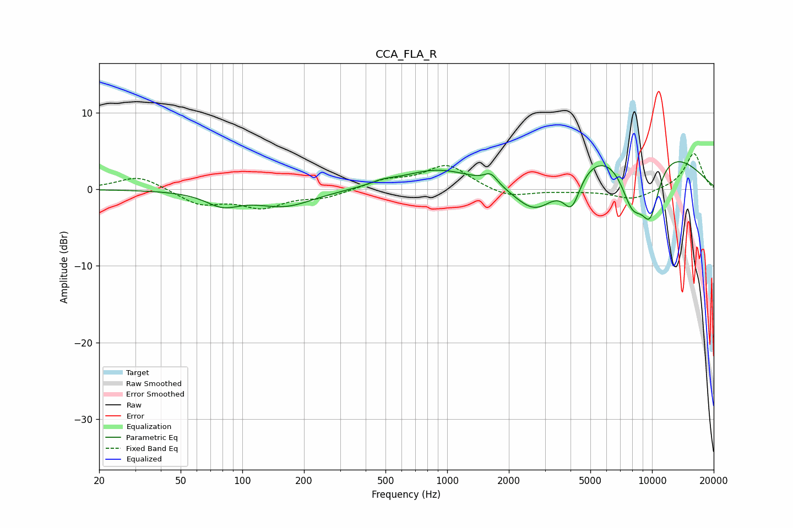

# CCA_FLA_R
See [usage instructions](https://github.com/jaakkopasanen/AutoEq#usage) for more options and info.

### Parametric EQs
Apply preamp of -3.7 dB when using parametric equalizer.

|   # | Type    |   Fc (Hz) |    Q |   Gain (dB) |
|-----|---------|-----------|------|-------------|
|   1 | Peaking |        80 | 1.71 |        -1.8 |
|   2 | Peaking |       161 | 0.99 |        -2.1 |
|   3 | Peaking |       484 | 2.29 |         0.5 |
|   4 | Peaking |       886 | 0.83 |         2.3 |
|   5 | Peaking |      1634 | 4.39 |         1.3 |
|   6 | Peaking |      2714 | 1.21 |        -5.9 |
|   7 | Peaking |      4057 | 3.23 |        -4.6 |
|   8 | Peaking |      7580 | 0.36 |         7.9 |
|   9 | Peaking |      8011 | 2.03 |        -7.2 |
|  10 | Peaking |      9789 | 2.49 |        -7.5 |

### Fixed Band EQs
When using fixed band (also called graphic) equalizer, apply preamp of **-4.8 dB** (if available) and set gains manually with these parameters.

|   # | Type    |   Fc (Hz) |    Q |   Gain (dB) |
|-----|---------|-----------|------|-------------|
|   1 | Peaking |        31 | 1.41 |         1.8 |
|   2 | Peaking |        62 | 1.41 |        -1.9 |
|   3 | Peaking |       125 | 1.41 |        -2.1 |
|   4 | Peaking |       250 | 1.41 |        -1   |
|   5 | Peaking |       500 | 1.41 |         1.1 |
|   6 | Peaking |      1000 | 1.41 |         3.2 |
|   7 | Peaking |      2000 | 1.41 |        -1.1 |
|   8 | Peaking |      4000 | 1.41 |        -0.2 |
|   9 | Peaking |      8000 | 1.41 |        -1.3 |
|  10 | Peaking |     16000 | 1.41 |         4.8 |

### Graphs

