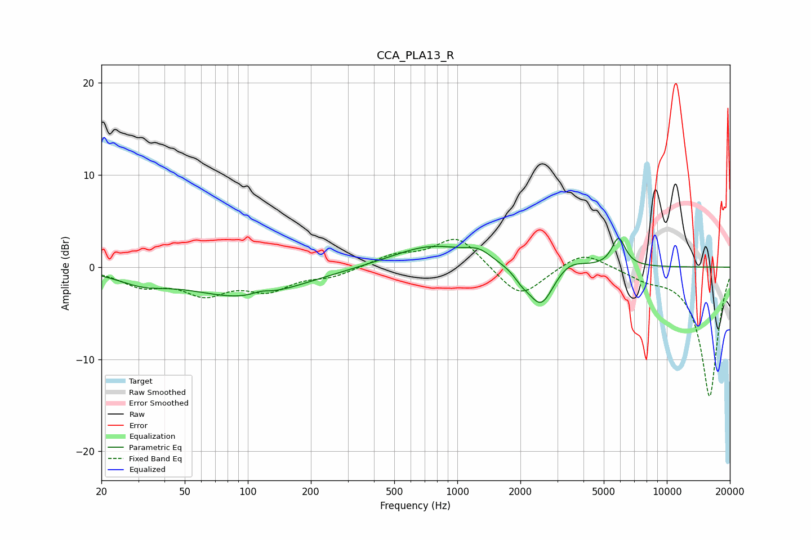

# CCA_PLA13_R
See [usage instructions](https://github.com/jaakkopasanen/AutoEq#usage) for more options and info.

### Parametric EQs
Apply preamp of -3.2 dB when using parametric equalizer.

|   # | Type    |   Fc (Hz) |    Q |   Gain (dB) |
|-----|---------|-----------|------|-------------|
|   1 | Peaking |        31 | 1.21 |        -1.2 |
|   2 | Peaking |        97 | 0.54 |        -3.2 |
|   3 | Peaking |       115 | 3.42 |         0.4 |
|   4 | Peaking |       636 | 1.04 |        -0.1 |
|   5 | Peaking |       747 | 0.76 |         2.4 |
|   6 | Peaking |      1267 | 2.39 |         1   |
|   7 | Peaking |      2029 | 3.88 |        -0.8 |
|   8 | Peaking |      2509 | 2.3  |        -4.5 |
|   9 | Peaking |      3412 | 2.04 |         1.1 |
|  10 | Peaking |      5887 | 4.26 |         3.1 |

### Fixed Band EQs
When using fixed band (also called graphic) equalizer, apply preamp of **-3.1 dB** (if available) and set gains manually with these parameters.

|   # | Type    |   Fc (Hz) |    Q |   Gain (dB) |
|-----|---------|-----------|------|-------------|
|   1 | Peaking |        31 | 1.41 |        -1.8 |
|   2 | Peaking |        62 | 1.41 |        -2.6 |
|   3 | Peaking |       125 | 1.41 |        -2.2 |
|   4 | Peaking |       250 | 1.41 |        -0.9 |
|   5 | Peaking |       500 | 1.41 |         1.2 |
|   6 | Peaking |      1000 | 1.41 |         3.4 |
|   7 | Peaking |      2000 | 1.41 |        -3.5 |
|   8 | Peaking |      4000 | 1.41 |         1.9 |
|   9 | Peaking |      8000 | 1.41 |        -1   |
|  10 | Peaking |     16000 | 1.41 |       -14.1 |

### Graphs

