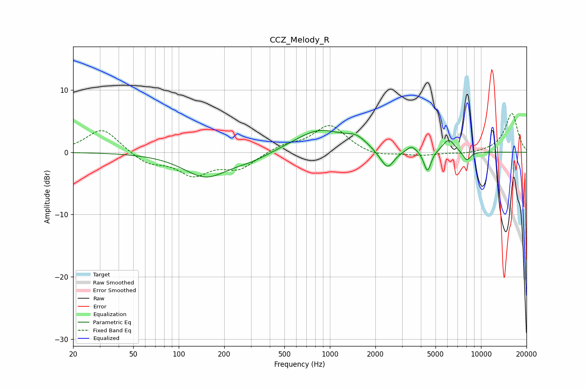

# CCZ_Melody_R
See [usage instructions](https://github.com/jaakkopasanen/AutoEq#usage) for more options and info.

### Parametric EQs
Apply preamp of -3.6 dB when using parametric equalizer.

|   # | Type    |   Fc (Hz) |    Q |   Gain (dB) |
|-----|---------|-----------|------|-------------|
|   1 | Peaking |       151 | 0.96 |        -3.9 |
|   2 | Peaking |       303 | 1.17 |        -1   |
|   3 | Peaking |       856 | 0.86 |         3.6 |
|   4 | Peaking |      1498 | 2.2  |         1.4 |
|   5 | Peaking |      2178 | 2.63 |        -0.5 |
|   6 | Peaking |      2418 | 3.35 |        -2.8 |
|   7 | Peaking |      3475 | 4.16 |         1.1 |
|   8 | Peaking |      4424 | 6    |        -3.4 |
|   9 | Peaking |      6110 | 3.41 |         2.1 |
|  10 | Peaking |      8051 | 5.05 |        -1.5 |

### Fixed Band EQs
When using fixed band (also called graphic) equalizer, apply preamp of **-6.3 dB** (if available) and set gains manually with these parameters.

|   # | Type    |   Fc (Hz) |    Q |   Gain (dB) |
|-----|---------|-----------|------|-------------|
|   1 | Peaking |        31 | 1.41 |         3.9 |
|   2 | Peaking |        62 | 1.41 |        -1.8 |
|   3 | Peaking |       125 | 1.41 |        -3.4 |
|   4 | Peaking |       250 | 1.41 |        -2.5 |
|   5 | Peaking |       500 | 1.41 |         1.1 |
|   6 | Peaking |      1000 | 1.41 |         4.4 |
|   7 | Peaking |      2000 | 1.41 |        -0.8 |
|   8 | Peaking |      4000 | 1.41 |        -0.5 |
|   9 | Peaking |      8000 | 1.41 |        -0.3 |
|  10 | Peaking |     16000 | 1.41 |         6.3 |

### Graphs

