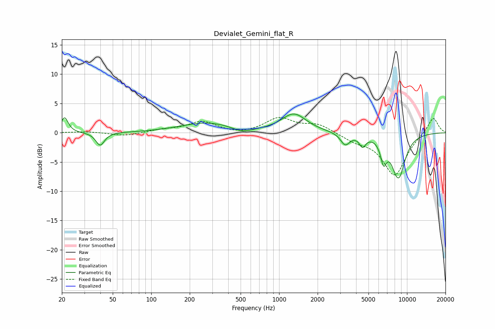

# Devialet_Gemini_flat_R
See [usage instructions](https://github.com/jaakkopasanen/AutoEq#usage) for more options and info.

### Parametric EQs
Apply preamp of -3.3 dB when using parametric equalizer.

|   # | Type    |   Fc (Hz) |    Q |   Gain (dB) |
|-----|---------|-----------|------|-------------|
|   1 | Peaking |        21 | 5.18 |         2.6 |
|   2 | Peaking |        40 | 4.27 |        -2.2 |
|   3 | Peaking |       271 | 0.7  |         1.7 |
|   4 | Peaking |       516 | 1.87 |        -0.8 |
|   5 | Peaking |      1306 | 1.46 |         3.2 |
|   6 | Peaking |      3286 | 3.88 |        -2   |
|   7 | Peaking |      4492 | 5.66 |        -1.8 |
|   8 | Peaking |      6556 | 5.71 |        -3.5 |
|   9 | Peaking |      8532 | 6    |         0.9 |
|  10 | Peaking |      8555 | 2.61 |        -8.4 |

### Fixed Band EQs
When using fixed band (also called graphic) equalizer, apply preamp of **-2.7 dB** (if available) and set gains manually with these parameters.

|   # | Type    |   Fc (Hz) |    Q |   Gain (dB) |
|-----|---------|-----------|------|-------------|
|   1 | Peaking |        31 | 1.41 |         0.2 |
|   2 | Peaking |        62 | 1.41 |        -0.6 |
|   3 | Peaking |       125 | 1.41 |         0.5 |
|   4 | Peaking |       250 | 1.41 |         1.9 |
|   5 | Peaking |       500 | 1.41 |        -0.4 |
|   6 | Peaking |      1000 | 1.41 |         2.4 |
|   7 | Peaking |      2000 | 1.41 |         1.4 |
|   8 | Peaking |      4000 | 1.41 |        -1.2 |
|   9 | Peaking |      8000 | 1.41 |        -7.2 |
|  10 | Peaking |     16000 | 1.41 |         2.8 |

### Graphs

