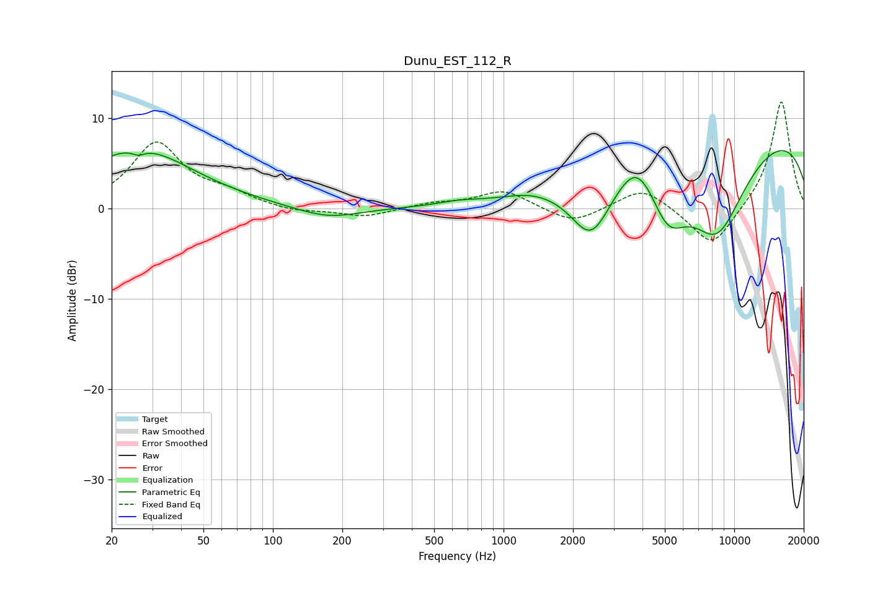

# Dunu_EST_112_R
See [usage instructions](https://github.com/jaakkopasanen/AutoEq#usage) for more options and info.

### Parametric EQs
Apply preamp of -6.5 dB when using parametric equalizer.

|   # | Type    |   Fc (Hz) |    Q |   Gain (dB) |
|-----|---------|-----------|------|-------------|
|   1 | Peaking |        26 | 0.59 |         6.5 |
|   2 | Peaking |        26 | 5.24 |        -0.6 |
|   3 | Peaking |       173 | 1.03 |        -1.3 |
|   4 | Peaking |       634 | 1.75 |         0.3 |
|   5 | Peaking |      1296 | 1.6  |         0.3 |
|   6 | Peaking |      2400 | 1.51 |        -7.2 |
|   7 | Peaking |      3791 | 1.79 |         3.3 |
|   8 | Peaking |      5159 | 1.69 |        -5.8 |
|   9 | Peaking |      8400 | 0.89 |       -11.3 |
|  10 | Peaking |      9717 | 0.18 |         9.8 |

### Fixed Band EQs
When using fixed band (also called graphic) equalizer, apply preamp of **-11.9 dB** (if available) and set gains manually with these parameters.

|   # | Type    |   Fc (Hz) |    Q |   Gain (dB) |
|-----|---------|-----------|------|-------------|
|   1 | Peaking |        31 | 1.41 |         7.1 |
|   2 | Peaking |        62 | 1.41 |         1.3 |
|   3 | Peaking |       125 | 1.41 |        -0.5 |
|   4 | Peaking |       250 | 1.41 |        -1   |
|   5 | Peaking |       500 | 1.41 |         0.5 |
|   6 | Peaking |      1000 | 1.41 |         2   |
|   7 | Peaking |      2000 | 1.41 |        -1.8 |
|   8 | Peaking |      4000 | 1.41 |         2.4 |
|   9 | Peaking |      8000 | 1.41 |        -4.5 |
|  10 | Peaking |     16000 | 1.41 |        12.1 |

### Graphs

