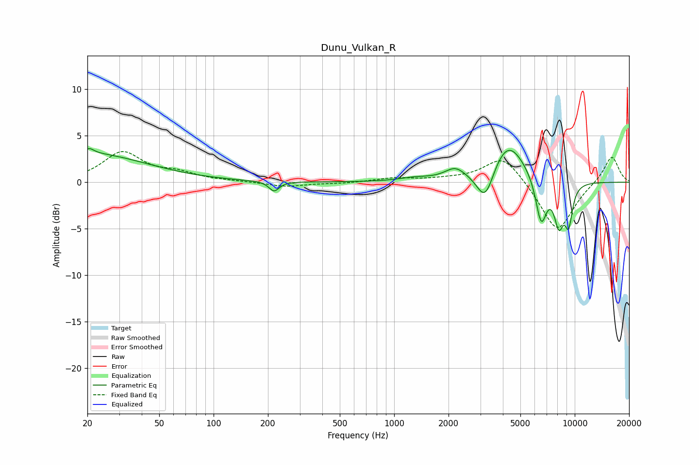

# Dunu_Vulkan_R
See [usage instructions](https://github.com/jaakkopasanen/AutoEq#usage) for more options and info.

### Parametric EQs
Apply preamp of -3.7 dB when using parametric equalizer.

|   # | Type    |   Fc (Hz) |    Q |   Gain (dB) |
|-----|---------|-----------|------|-------------|
|   1 | Peaking |        20 | 0.44 |         3.1 |
|   2 | Peaking |        21 | 5.64 |         0.5 |
|   3 | Peaking |       216 | 5.08 |        -1.1 |
|   4 | Peaking |      1296 | 1.67 |         0.3 |
|   5 | Peaking |      2176 | 2.52 |         1.2 |
|   6 | Peaking |      3196 | 2.88 |        -3.7 |
|   7 | Peaking |      4246 | 1.45 |         4.6 |
|   8 | Peaking |      6518 | 4.42 |        -4.9 |
|   9 | Peaking |      8178 | 4.75 |        -4.3 |
|  10 | Peaking |      9253 | 6    |        -3.9 |

### Fixed Band EQs
When using fixed band (also called graphic) equalizer, apply preamp of **-3.4 dB** (if available) and set gains manually with these parameters.

|   # | Type    |   Fc (Hz) |    Q |   Gain (dB) |
|-----|---------|-----------|------|-------------|
|   1 | Peaking |        31 | 1.41 |         3.1 |
|   2 | Peaking |        62 | 1.41 |         0.8 |
|   3 | Peaking |       125 | 1.41 |         0.1 |
|   4 | Peaking |       250 | 1.41 |        -0.5 |
|   5 | Peaking |       500 | 1.41 |        -0.1 |
|   6 | Peaking |      1000 | 1.41 |         0.4 |
|   7 | Peaking |      2000 | 1.41 |         0.2 |
|   8 | Peaking |      4000 | 1.41 |         3   |
|   9 | Peaking |      8000 | 1.41 |        -5.4 |
|  10 | Peaking |     16000 | 1.41 |         2.9 |

### Graphs

