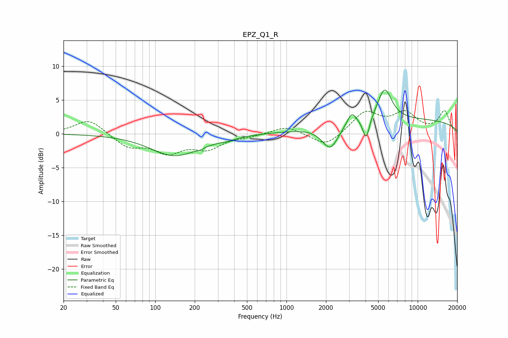

# EPZ_Q1_R
See [usage instructions](https://github.com/jaakkopasanen/AutoEq#usage) for more options and info.

### Parametric EQs
Apply preamp of -6.6 dB when using parametric equalizer.

|   # | Type    |   Fc (Hz) |    Q |   Gain (dB) |
|-----|---------|-----------|------|-------------|
|   1 | Peaking |       141 | 0.78 |        -3.2 |
|   2 | Peaking |       221 | 4.78 |        -0.3 |
|   3 | Peaking |       272 | 5.99 |        -0   |
|   4 | Peaking |       357 | 2.12 |        -0.4 |
|   5 | Peaking |      2147 | 2.43 |        -2.1 |
|   6 | Peaking |      2175 | 2.04 |        -1.4 |
|   7 | Peaking |      3141 | 4.06 |         1.9 |
|   8 | Peaking |      4051 | 5.48 |        -3.3 |
|   9 | Peaking |      5601 | 2.55 |         4.7 |
|  10 | Peaking |      8023 | 0.18 |         2.1 |

### Fixed Band EQs
When using fixed band (also called graphic) equalizer, apply preamp of **-3.5 dB** (if available) and set gains manually with these parameters.

|   # | Type    |   Fc (Hz) |    Q |   Gain (dB) |
|-----|---------|-----------|------|-------------|
|   1 | Peaking |        31 | 1.41 |         2.2 |
|   2 | Peaking |        62 | 1.41 |        -1.9 |
|   3 | Peaking |       125 | 1.41 |        -2.5 |
|   4 | Peaking |       250 | 1.41 |        -2   |
|   5 | Peaking |       500 | 1.41 |        -0.3 |
|   6 | Peaking |      1000 | 1.41 |         1.2 |
|   7 | Peaking |      2000 | 1.41 |        -2   |
|   8 | Peaking |      4000 | 1.41 |         3.2 |
|   9 | Peaking |      8000 | 1.41 |         2.8 |
|  10 | Peaking |     16000 | 1.41 |         3.3 |

### Graphs

