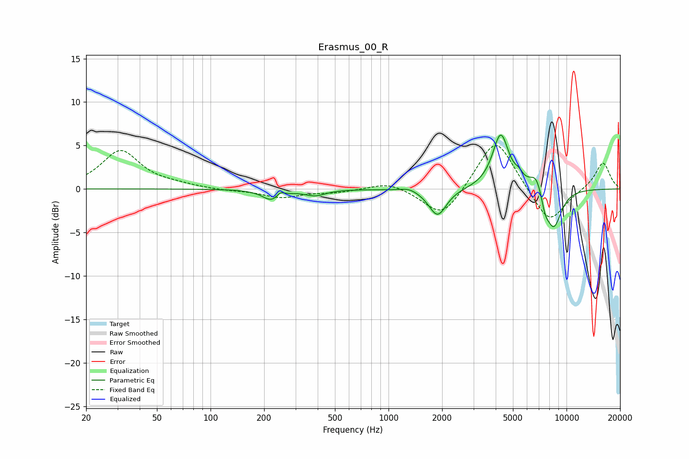

# Erasmus_00_R
See [usage instructions](https://github.com/jaakkopasanen/AutoEq#usage) for more options and info.

### Parametric EQs
Apply preamp of -6.3 dB when using parametric equalizer.

|   # | Type    |   Fc (Hz) |    Q |   Gain (dB) |
|-----|---------|-----------|------|-------------|
|   1 | Peaking |       223 | 2.7  |        -1.3 |
|   2 | Peaking |       246 | 6    |         0.7 |
|   3 | Peaking |       387 | 2.41 |        -0.7 |
|   4 | Peaking |      1302 | 3.02 |         0.4 |
|   5 | Peaking |      1886 | 2.85 |        -3.1 |
|   6 | Peaking |      4268 | 3.06 |         6.3 |
|   7 | Peaking |      5398 | 6    |         0.7 |
|   8 | Peaking |      6778 | 3.64 |         2.1 |
|   9 | Peaking |      7571 | 5.97 |        -1.6 |
|  10 | Peaking |      8469 | 2.89 |        -4.6 |

### Fixed Band EQs
When using fixed band (also called graphic) equalizer, apply preamp of **-5.1 dB** (if available) and set gains manually with these parameters.

|   # | Type    |   Fc (Hz) |    Q |   Gain (dB) |
|-----|---------|-----------|------|-------------|
|   1 | Peaking |        31 | 1.41 |         4.4 |
|   2 | Peaking |        62 | 1.41 |         0.3 |
|   3 | Peaking |       125 | 1.41 |        -0.2 |
|   4 | Peaking |       250 | 1.41 |        -1   |
|   5 | Peaking |       500 | 1.41 |        -0.4 |
|   6 | Peaking |      1000 | 1.41 |         0.9 |
|   7 | Peaking |      2000 | 1.41 |        -3.5 |
|   8 | Peaking |      4000 | 1.41 |         6.2 |
|   9 | Peaking |      8000 | 1.41 |        -4.2 |
|  10 | Peaking |     16000 | 1.41 |         3.1 |

### Graphs

