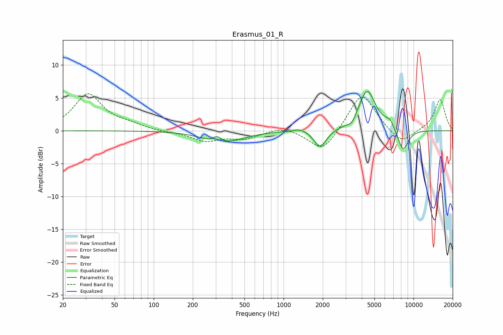

# Erasmus_01_R
See [usage instructions](https://github.com/jaakkopasanen/AutoEq#usage) for more options and info.

### Parametric EQs
Apply preamp of -6.1 dB when using parametric equalizer.

|   # | Type    |   Fc (Hz) |    Q |   Gain (dB) |
|-----|---------|-----------|------|-------------|
|   1 | Peaking |       308 | 4.54 |         0.9 |
|   2 | Peaking |       316 | 1.14 |        -1.6 |
|   3 | Peaking |       456 | 1.29 |        -0.4 |
|   4 | Peaking |      1352 | 2.74 |         0.5 |
|   5 | Peaking |      1911 | 3.01 |        -2.7 |
|   6 | Peaking |      3346 | 4.89 |        -0.9 |
|   7 | Peaking |      4391 | 2.17 |         6.2 |
|   8 | Peaking |      6278 | 4.12 |        -0.9 |
|   9 | Peaking |      6446 | 3.55 |         2.1 |
|  10 | Peaking |      8283 | 3.1  |        -3.4 |

### Fixed Band EQs
When using fixed band (also called graphic) equalizer, apply preamp of **-5.7 dB** (if available) and set gains manually with these parameters.

|   # | Type    |   Fc (Hz) |    Q |   Gain (dB) |
|-----|---------|-----------|------|-------------|
|   1 | Peaking |        31 | 1.41 |         5.5 |
|   2 | Peaking |        62 | 1.41 |         0.8 |
|   3 | Peaking |       125 | 1.41 |        -0.2 |
|   4 | Peaking |       250 | 1.41 |        -1.5 |
|   5 | Peaking |       500 | 1.41 |        -1.1 |
|   6 | Peaking |      1000 | 1.41 |         0.8 |
|   7 | Peaking |      2000 | 1.41 |        -3.4 |
|   8 | Peaking |      4000 | 1.41 |         6   |
|   9 | Peaking |      8000 | 1.41 |        -2.3 |
|  10 | Peaking |     16000 | 1.41 |         4.8 |

### Graphs

