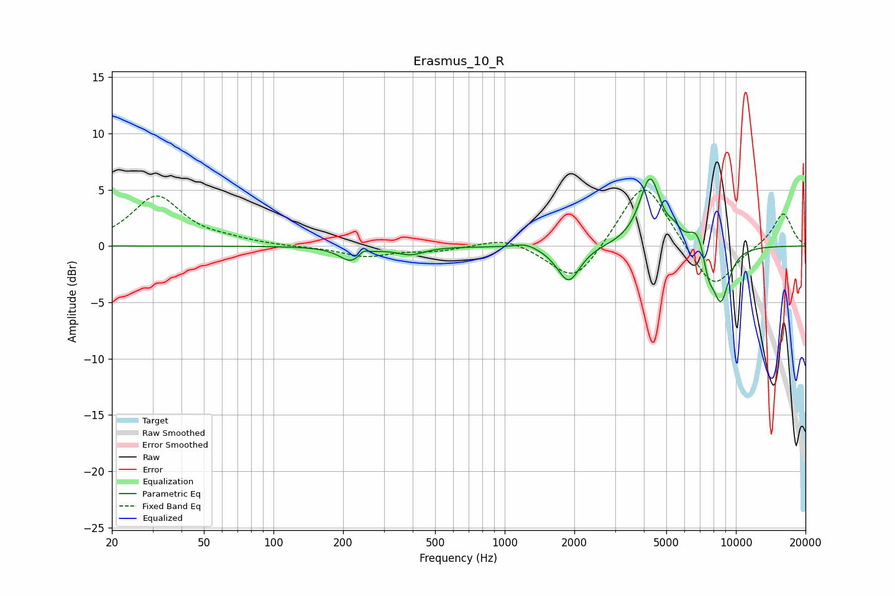

# Erasmus_10_R
See [usage instructions](https://github.com/jaakkopasanen/AutoEq#usage) for more options and info.

### Parametric EQs
Apply preamp of -6.1 dB when using parametric equalizer.

|   # | Type    |   Fc (Hz) |    Q |   Gain (dB) |
|-----|---------|-----------|------|-------------|
|   1 | Peaking |       218 | 2.82 |        -1.4 |
|   2 | Peaking |       244 | 6    |         0.6 |
|   3 | Peaking |       392 | 2.41 |        -0.7 |
|   4 | Peaking |      1237 | 2.97 |         0.4 |
|   5 | Peaking |      1890 | 2.89 |        -3.2 |
|   6 | Peaking |      4254 | 3.09 |         6.1 |
|   7 | Peaking |      5408 | 6    |         0.6 |
|   8 | Peaking |      6813 | 3.9  |         1.9 |
|   9 | Peaking |      7600 | 5.89 |        -1.9 |
|  10 | Peaking |      8602 | 3.48 |        -5   |

### Fixed Band EQs
When using fixed band (also called graphic) equalizer, apply preamp of **-5.1 dB** (if available) and set gains manually with these parameters.

|   # | Type    |   Fc (Hz) |    Q |   Gain (dB) |
|-----|---------|-----------|------|-------------|
|   1 | Peaking |        31 | 1.41 |         4.4 |
|   2 | Peaking |        62 | 1.41 |         0.4 |
|   3 | Peaking |       125 | 1.41 |        -0.1 |
|   4 | Peaking |       250 | 1.41 |        -0.9 |
|   5 | Peaking |       500 | 1.41 |        -0.4 |
|   6 | Peaking |      1000 | 1.41 |         0.8 |
|   7 | Peaking |      2000 | 1.41 |        -3.5 |
|   8 | Peaking |      4000 | 1.41 |         6.1 |
|   9 | Peaking |      8000 | 1.41 |        -4.1 |
|  10 | Peaking |     16000 | 1.41 |         3   |

### Graphs

