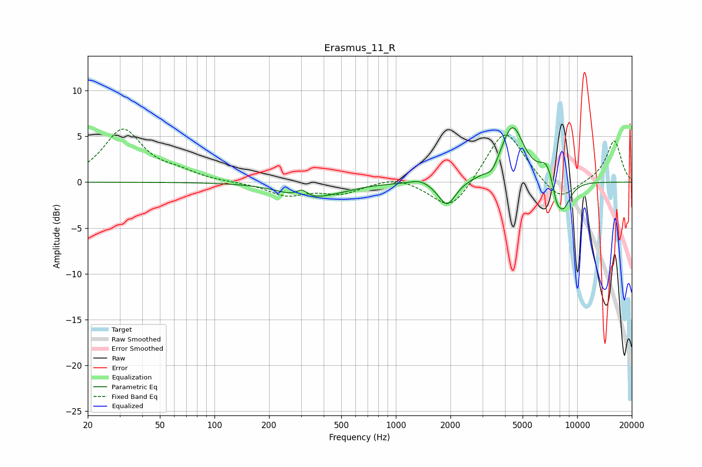

# Erasmus_11_R
See [usage instructions](https://github.com/jaakkopasanen/AutoEq#usage) for more options and info.

### Parametric EQs
Apply preamp of -6.0 dB when using parametric equalizer.

|   # | Type    |   Fc (Hz) |    Q |   Gain (dB) |
|-----|---------|-----------|------|-------------|
|   1 | Peaking |       304 | 4.42 |         0.9 |
|   2 | Peaking |       315 | 1.17 |        -1.6 |
|   3 | Peaking |       477 | 1.25 |        -0.5 |
|   4 | Peaking |      1361 | 2.7  |         0.5 |
|   5 | Peaking |      1913 | 3    |        -2.7 |
|   6 | Peaking |      3394 | 4.68 |        -0.9 |
|   7 | Peaking |      4392 | 2.2  |         6.1 |
|   8 | Peaking |      6802 | 3.51 |         2.1 |
|   9 | Peaking |      7666 | 6    |        -1.3 |
|  10 | Peaking |      8332 | 3.05 |        -3.4 |

### Fixed Band EQs
When using fixed band (also called graphic) equalizer, apply preamp of **-5.9 dB** (if available) and set gains manually with these parameters.

|   # | Type    |   Fc (Hz) |    Q |   Gain (dB) |
|-----|---------|-----------|------|-------------|
|   1 | Peaking |        31 | 1.41 |         5.7 |
|   2 | Peaking |        62 | 1.41 |         0.8 |
|   3 | Peaking |       125 | 1.41 |        -0   |
|   4 | Peaking |       250 | 1.41 |        -1.4 |
|   5 | Peaking |       500 | 1.41 |        -1.2 |
|   6 | Peaking |      1000 | 1.41 |         0.7 |
|   7 | Peaking |      2000 | 1.41 |        -3.3 |
|   8 | Peaking |      4000 | 1.41 |         6   |
|   9 | Peaking |      8000 | 1.41 |        -2.3 |
|  10 | Peaking |     16000 | 1.41 |         4.6 |

### Graphs

