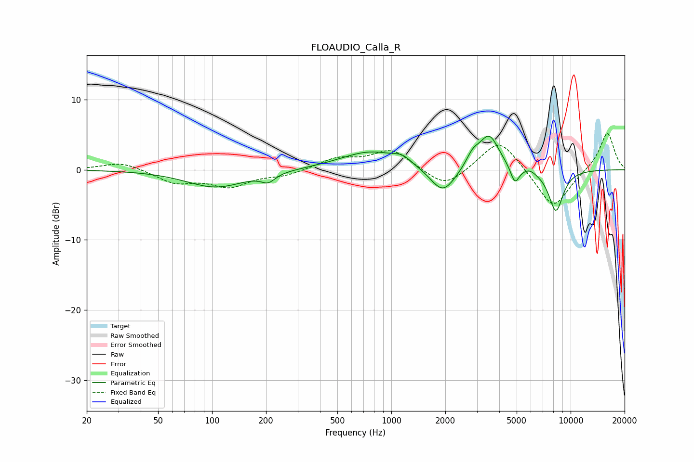

# FLOAUDIO_Calla_R
See [usage instructions](https://github.com/jaakkopasanen/AutoEq#usage) for more options and info.

### Parametric EQs
Apply preamp of -4.9 dB when using parametric equalizer.

|   # | Type    |   Fc (Hz) |    Q |   Gain (dB) |
|-----|---------|-----------|------|-------------|
|   1 | Peaking |       105 | 0.86 |        -2.5 |
|   2 | Peaking |       206 | 3.68 |        -1.2 |
|   3 | Peaking |       772 | 0.83 |         2.6 |
|   4 | Peaking |      1150 | 3.07 |         0.9 |
|   5 | Peaking |      1939 | 2    |        -3.9 |
|   6 | Peaking |      2846 | 3.75 |         1.7 |
|   7 | Peaking |      3513 | 2.53 |         4.9 |
|   8 | Peaking |      4887 | 5.78 |        -2.5 |
|   9 | Peaking |      5920 | 4.6  |         0.4 |
|  10 | Peaking |      8278 | 3.17 |        -5.9 |

### Fixed Band EQs
When using fixed band (also called graphic) equalizer, apply preamp of **-5.2 dB** (if available) and set gains manually with these parameters.

|   # | Type    |   Fc (Hz) |    Q |   Gain (dB) |
|-----|---------|-----------|------|-------------|
|   1 | Peaking |        31 | 1.41 |         1.2 |
|   2 | Peaking |        62 | 1.41 |        -1.8 |
|   3 | Peaking |       125 | 1.41 |        -2.2 |
|   4 | Peaking |       250 | 1.41 |        -0.8 |
|   5 | Peaking |       500 | 1.41 |         1.5 |
|   6 | Peaking |      1000 | 1.41 |         2.8 |
|   7 | Peaking |      2000 | 1.41 |        -2.8 |
|   8 | Peaking |      4000 | 1.41 |         4.6 |
|   9 | Peaking |      8000 | 1.41 |        -5.7 |
|  10 | Peaking |     16000 | 1.41 |         5.4 |

### Graphs

