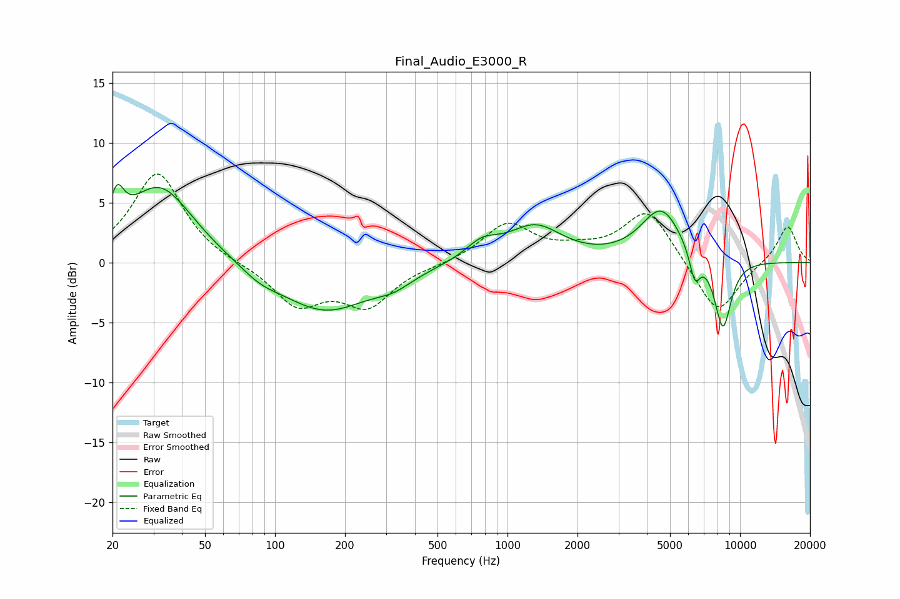

# Final_Audio_E3000_R
See [usage instructions](https://github.com/jaakkopasanen/AutoEq#usage) for more options and info.

### Parametric EQs
Apply preamp of -6.6 dB when using parametric equalizer.

|   # | Type    |   Fc (Hz) |    Q |   Gain (dB) |
|-----|---------|-----------|------|-------------|
|   1 | Peaking |        21 | 4.82 |         2.9 |
|   2 | Peaking |        32 | 0.98 |         6.4 |
|   3 | Peaking |        86 | 1.68 |        -0.8 |
|   4 | Peaking |       164 | 0.72 |        -4.1 |
|   5 | Peaking |       324 | 1.73 |        -0.9 |
|   6 | Peaking |       778 | 1.96 |         1.4 |
|   7 | Peaking |      1314 | 1.21 |         2.9 |
|   8 | Peaking |      4593 | 1.57 |         4.4 |
|   9 | Peaking |      6395 | 5.87 |        -2.5 |
|  10 | Peaking |      8440 | 3.5  |        -5.9 |

### Fixed Band EQs
When using fixed band (also called graphic) equalizer, apply preamp of **-7.5 dB** (if available) and set gains manually with these parameters.

|   # | Type    |   Fc (Hz) |    Q |   Gain (dB) |
|-----|---------|-----------|------|-------------|
|   1 | Peaking |        31 | 1.41 |         7.6 |
|   2 | Peaking |        62 | 1.41 |        -0.2 |
|   3 | Peaking |       125 | 1.41 |        -3.4 |
|   4 | Peaking |       250 | 1.41 |        -3.4 |
|   5 | Peaking |       500 | 1.41 |        -0.1 |
|   6 | Peaking |      1000 | 1.41 |         3.2 |
|   7 | Peaking |      2000 | 1.41 |         0.7 |
|   8 | Peaking |      4000 | 1.41 |         4.5 |
|   9 | Peaking |      8000 | 1.41 |        -4.5 |
|  10 | Peaking |     16000 | 1.41 |         3.2 |

### Graphs

