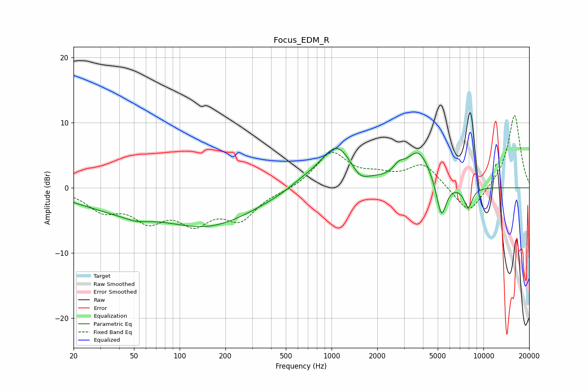

# Focus_EDM_R
See [usage instructions](https://github.com/jaakkopasanen/AutoEq#usage) for more options and info.

### Parametric EQs
Apply preamp of -6.1 dB when using parametric equalizer.

|   # | Type    |   Fc (Hz) |    Q |   Gain (dB) |
|-----|---------|-----------|------|-------------|
|   1 | Peaking |        36 | 0.54 |        -2.5 |
|   2 | Peaking |        52 | 1.79 |        -0.7 |
|   3 | Peaking |       156 | 0.46 |        -5.5 |
|   4 | Peaking |       647 | 1.4  |         0.9 |
|   5 | Peaking |      1081 | 1.29 |         6.5 |
|   6 | Peaking |      1533 | 2.56 |        -1.7 |
|   7 | Peaking |      2765 | 4.09 |         1.2 |
|   8 | Peaking |      3727 | 1.71 |         5.4 |
|   9 | Peaking |      5286 | 4.23 |        -5.8 |
|  10 | Peaking |      7931 | 4.66 |        -3.2 |

### Fixed Band EQs
When using fixed band (also called graphic) equalizer, apply preamp of **-11.2 dB** (if available) and set gains manually with these parameters.

|   # | Type    |   Fc (Hz) |    Q |   Gain (dB) |
|-----|---------|-----------|------|-------------|
|   1 | Peaking |        31 | 1.41 |        -3.1 |
|   2 | Peaking |        62 | 1.41 |        -4.3 |
|   3 | Peaking |       125 | 1.41 |        -4.6 |
|   4 | Peaking |       250 | 1.41 |        -4.4 |
|   5 | Peaking |       500 | 1.41 |        -0.4 |
|   6 | Peaking |      1000 | 1.41 |         5.4 |
|   7 | Peaking |      2000 | 1.41 |         1.4 |
|   8 | Peaking |      4000 | 1.41 |         3.6 |
|   9 | Peaking |      8000 | 1.41 |        -4.4 |
|  10 | Peaking |     16000 | 1.41 |        11.4 |

### Graphs

