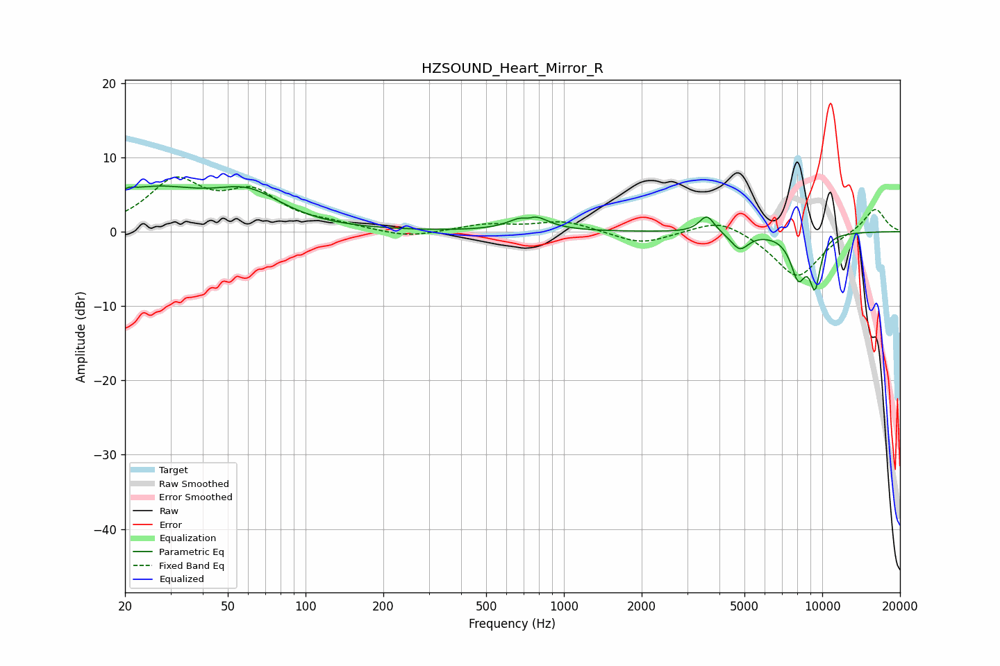

# HZSOUND_Heart_Mirror_R
See [usage instructions](https://github.com/jaakkopasanen/AutoEq#usage) for more options and info.

### Parametric EQs
Apply preamp of -6.2 dB when using parametric equalizer.

|   # | Type    |   Fc (Hz) |    Q |   Gain (dB) |
|-----|---------|-----------|------|-------------|
|   1 | Peaking |        20 | 5.78 |        -2.1 |
|   2 | Peaking |        20 | 5.68 |         2.6 |
|   3 | Peaking |        25 | 0.7  |         5.2 |
|   4 | Peaking |        60 | 1.06 |         4   |
|   5 | Peaking |       726 | 5.56 |        -1   |
|   6 | Peaking |       734 | 2.52 |         2.8 |
|   7 | Peaking |      3577 | 4.85 |         2.3 |
|   8 | Peaking |      4795 | 4.08 |        -2.3 |
|   9 | Peaking |      8084 | 4.24 |        -5.6 |
|  10 | Peaking |      9378 | 6    |        -6.3 |

### Fixed Band EQs
When using fixed band (also called graphic) equalizer, apply preamp of **-7.4 dB** (if available) and set gains manually with these parameters.

|   # | Type    |   Fc (Hz) |    Q |   Gain (dB) |
|-----|---------|-----------|------|-------------|
|   1 | Peaking |        31 | 1.41 |         6.4 |
|   2 | Peaking |        62 | 1.41 |         4.6 |
|   3 | Peaking |       125 | 1.41 |         0.7 |
|   4 | Peaking |       250 | 1.41 |        -0.9 |
|   5 | Peaking |       500 | 1.41 |         0.9 |
|   6 | Peaking |      1000 | 1.41 |         1.4 |
|   7 | Peaking |      2000 | 1.41 |        -1.7 |
|   8 | Peaking |      4000 | 1.41 |         2   |
|   9 | Peaking |      8000 | 1.41 |        -6.3 |
|  10 | Peaking |     16000 | 1.41 |         3.3 |

### Graphs

