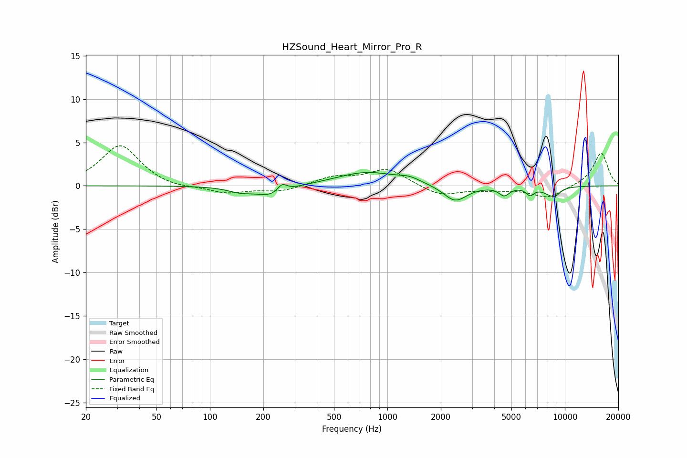

# HZSound_Heart_Mirror_Pro_R
See [usage instructions](https://github.com/jaakkopasanen/AutoEq#usage) for more options and info.

### Parametric EQs
Apply preamp of -1.6 dB when using parametric equalizer.

|   # | Type    |   Fc (Hz) |    Q |   Gain (dB) |
|-----|---------|-----------|------|-------------|
|   1 | Peaking |       148 | 1.95 |        -0.6 |
|   2 | Peaking |       225 | 1.63 |        -1.2 |
|   3 | Peaking |       255 | 5.05 |         1   |
|   4 | Peaking |       767 | 0.83 |         1.6 |
|   5 | Peaking |      1331 | 2.33 |         0.5 |
|   6 | Peaking |      2409 | 2.15 |        -1.9 |
|   7 | Peaking |      4552 | 4.88 |        -1   |
|   8 | Peaking |      6369 | 6    |        -0.9 |
|   9 | Peaking |      8353 | 2.94 |        -0.9 |
|  10 | Peaking |      8906 | 6    |        -0.4 |

### Fixed Band EQs
When using fixed band (also called graphic) equalizer, apply preamp of **-4.7 dB** (if available) and set gains manually with these parameters.

|   # | Type    |   Fc (Hz) |    Q |   Gain (dB) |
|-----|---------|-----------|------|-------------|
|   1 | Peaking |        31 | 1.41 |         4.7 |
|   2 | Peaking |        62 | 1.41 |        -0.4 |
|   3 | Peaking |       125 | 1.41 |        -0.8 |
|   4 | Peaking |       250 | 1.41 |        -0.7 |
|   5 | Peaking |       500 | 1.41 |         1   |
|   6 | Peaking |      1000 | 1.41 |         1.9 |
|   7 | Peaking |      2000 | 1.41 |        -1.2 |
|   8 | Peaking |      4000 | 1.41 |        -0.4 |
|   9 | Peaking |      8000 | 1.41 |        -1.4 |
|  10 | Peaking |     16000 | 1.41 |         3.8 |

### Graphs

