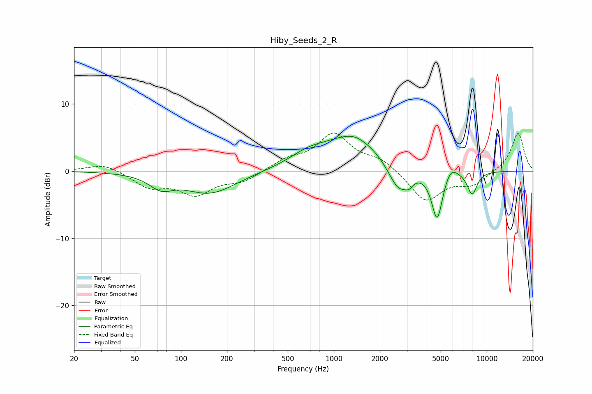

# Hiby_Seeds_2_R
See [usage instructions](https://github.com/jaakkopasanen/AutoEq#usage) for more options and info.

### Parametric EQs
Apply preamp of -5.3 dB when using parametric equalizer.

|   # | Type    |   Fc (Hz) |    Q |   Gain (dB) |
|-----|---------|-----------|------|-------------|
|   1 | Peaking |        74 | 1.86 |        -1.9 |
|   2 | Peaking |       155 | 0.83 |        -3.3 |
|   3 | Peaking |       674 | 1.15 |         1.5 |
|   4 | Peaking |      1341 | 0.72 |         5.1 |
|   5 | Peaking |      1355 | 2.58 |         0.3 |
|   6 | Peaking |      2657 | 1.98 |        -4.5 |
|   7 | Peaking |      3107 | 5.99 |        -0.8 |
|   8 | Peaking |      4739 | 3.81 |        -7.5 |
|   9 | Peaking |      5800 | 3.2  |         1.7 |
|  10 | Peaking |      8029 | 4.06 |        -3.4 |

### Fixed Band EQs
When using fixed band (also called graphic) equalizer, apply preamp of **-5.8 dB** (if available) and set gains manually with these parameters.

|   # | Type    |   Fc (Hz) |    Q |   Gain (dB) |
|-----|---------|-----------|------|-------------|
|   1 | Peaking |        31 | 1.41 |         1.2 |
|   2 | Peaking |        62 | 1.41 |        -2.2 |
|   3 | Peaking |       125 | 1.41 |        -3.2 |
|   4 | Peaking |       250 | 1.41 |        -1.4 |
|   5 | Peaking |       500 | 1.41 |         1.5 |
|   6 | Peaking |      1000 | 1.41 |         5.3 |
|   7 | Peaking |      2000 | 1.41 |         1.6 |
|   8 | Peaking |      4000 | 1.41 |        -4.5 |
|   9 | Peaking |      8000 | 1.41 |        -1.9 |
|  10 | Peaking |     16000 | 1.41 |         5.7 |

### Graphs

