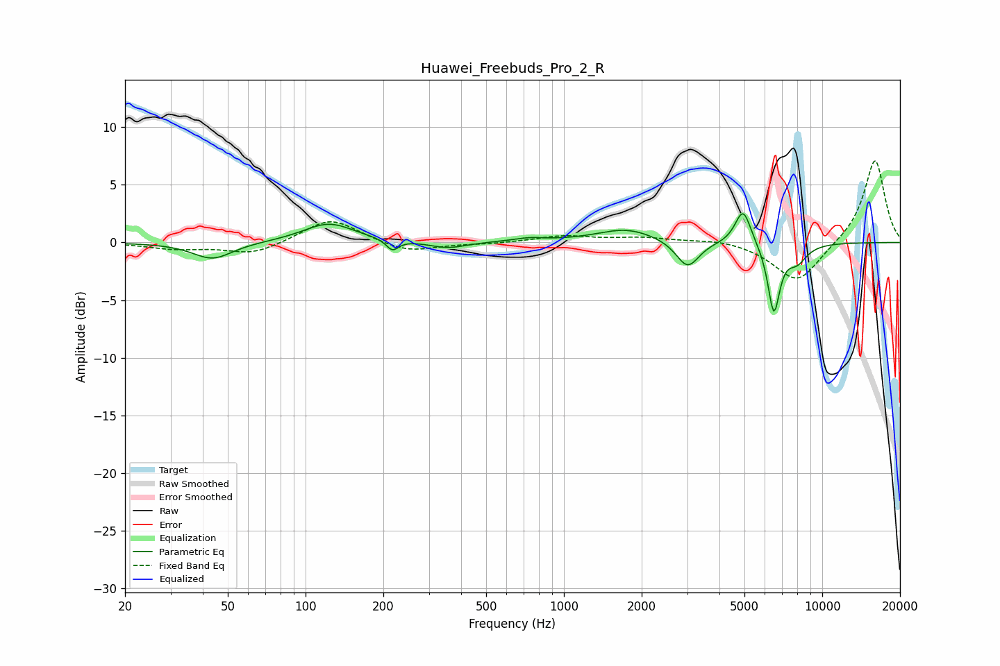

# Huawei_Freebuds_Pro_2_R
See [usage instructions](https://github.com/jaakkopasanen/AutoEq#usage) for more options and info.

### Parametric EQs
Apply preamp of -2.6 dB when using parametric equalizer.

|   # | Type    |   Fc (Hz) |    Q |   Gain (dB) |
|-----|---------|-----------|------|-------------|
|   1 | Peaking |        44 | 1.84 |        -1.5 |
|   2 | Peaking |       123 | 1.43 |         1.7 |
|   3 | Peaking |       217 | 5.99 |        -0.9 |
|   4 | Peaking |       355 | 1.99 |        -0.6 |
|   5 | Peaking |       733 | 2.31 |         0.3 |
|   6 | Peaking |      1749 | 1.23 |         1.2 |
|   7 | Peaking |      3012 | 3.19 |        -2.4 |
|   8 | Peaking |      4940 | 4.53 |         3.1 |
|   9 | Peaking |      6497 | 5.85 |        -5.9 |
|  10 | Peaking |      7975 | 3.29 |        -1.5 |

### Fixed Band EQs
When using fixed band (also called graphic) equalizer, apply preamp of **-7.2 dB** (if available) and set gains manually with these parameters.

|   # | Type    |   Fc (Hz) |    Q |   Gain (dB) |
|-----|---------|-----------|------|-------------|
|   1 | Peaking |        31 | 1.41 |        -0.5 |
|   2 | Peaking |        62 | 1.41 |        -1   |
|   3 | Peaking |       125 | 1.41 |         2.2 |
|   4 | Peaking |       250 | 1.41 |        -0.9 |
|   5 | Peaking |       500 | 1.41 |        -0.1 |
|   6 | Peaking |      1000 | 1.41 |         0.6 |
|   7 | Peaking |      2000 | 1.41 |         0.4 |
|   8 | Peaking |      4000 | 1.41 |         0.3 |
|   9 | Peaking |      8000 | 1.41 |        -3.5 |
|  10 | Peaking |     16000 | 1.41 |         7.3 |

### Graphs

