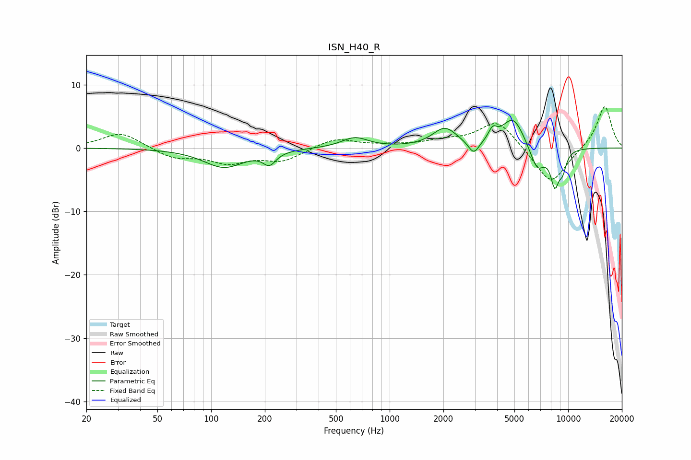

# ISN_H40_R
See [usage instructions](https://github.com/jaakkopasanen/AutoEq#usage) for more options and info.

### Parametric EQs
Apply preamp of -4.5 dB when using parametric equalizer.

|   # | Type    |   Fc (Hz) |    Q |   Gain (dB) |
|-----|---------|-----------|------|-------------|
|   1 | Peaking |       118 | 1.24 |        -3   |
|   2 | Peaking |       212 | 3.94 |        -1.9 |
|   3 | Peaking |       639 | 1.94 |         1.6 |
|   4 | Peaking |      2037 | 2.1  |         3   |
|   5 | Peaking |      2960 | 4.67 |        -2.1 |
|   6 | Peaking |      3776 | 6    |         1.7 |
|   7 | Peaking |      4916 | 2.16 |         4.9 |
|   8 | Peaking |      6706 | 3.19 |        -3.9 |
|   9 | Peaking |      8423 | 5.3  |        -5.3 |
|  10 | Peaking |      9311 | 6    |        -2.6 |

### Fixed Band EQs
When using fixed band (also called graphic) equalizer, apply preamp of **-6.6 dB** (if available) and set gains manually with these parameters.

|   # | Type    |   Fc (Hz) |    Q |   Gain (dB) |
|-----|---------|-----------|------|-------------|
|   1 | Peaking |        31 | 1.41 |         2.5 |
|   2 | Peaking |        62 | 1.41 |        -1.6 |
|   3 | Peaking |       125 | 1.41 |        -2.1 |
|   4 | Peaking |       250 | 1.41 |        -2   |
|   5 | Peaking |       500 | 1.41 |         1.6 |
|   6 | Peaking |      1000 | 1.41 |         0.3 |
|   7 | Peaking |      2000 | 1.41 |         0.9 |
|   8 | Peaking |      4000 | 1.41 |         4.4 |
|   9 | Peaking |      8000 | 1.41 |        -6   |
|  10 | Peaking |     16000 | 1.41 |         6.8 |

### Graphs

