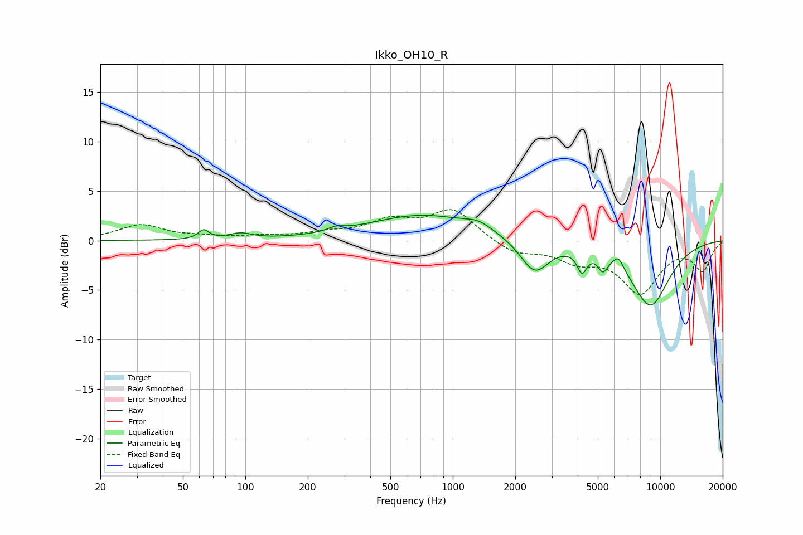

# Ikko_OH10_R
See [usage instructions](https://github.com/jaakkopasanen/AutoEq#usage) for more options and info.

### Parametric EQs
Apply preamp of -2.6 dB when using parametric equalizer.

|   # | Type    |   Fc (Hz) |    Q |   Gain (dB) |
|-----|---------|-----------|------|-------------|
|   1 | Peaking |        63 | 5.7  |         0.9 |
|   2 | Peaking |        95 | 2.6  |         0.6 |
|   3 | Peaking |       274 | 3.63 |         0.4 |
|   4 | Peaking |       719 | 0.54 |         2.6 |
|   5 | Peaking |      1331 | 2.22 |         0.7 |
|   6 | Peaking |      2478 | 2.04 |        -3.4 |
|   7 | Peaking |      4196 | 6    |        -2.1 |
|   8 | Peaking |      5290 | 6    |        -1.5 |
|   9 | Peaking |      6286 | 5.44 |         1.1 |
|  10 | Peaking |      8956 | 1.34 |        -6.5 |

### Fixed Band EQs
When using fixed band (also called graphic) equalizer, apply preamp of **-3.2 dB** (if available) and set gains manually with these parameters.

|   # | Type    |   Fc (Hz) |    Q |   Gain (dB) |
|-----|---------|-----------|------|-------------|
|   1 | Peaking |        31 | 1.41 |         1.5 |
|   2 | Peaking |        62 | 1.41 |         0.3 |
|   3 | Peaking |       125 | 1.41 |         0.3 |
|   4 | Peaking |       250 | 1.41 |         0.6 |
|   5 | Peaking |       500 | 1.41 |         1.8 |
|   6 | Peaking |      1000 | 1.41 |         3.1 |
|   7 | Peaking |      2000 | 1.41 |        -1.3 |
|   8 | Peaking |      4000 | 1.41 |        -1.7 |
|   9 | Peaking |      8000 | 1.41 |        -5.1 |
|  10 | Peaking |     16000 | 1.41 |        -2.9 |

### Graphs

